# 1 集合与函数

## 1.1 集合

### 1.1.1 集合的概念

一般的，我们称所研究的对象为==元素==，称具有某种属性的元素构成的全体为==集合==,集合具有==确定性==和==互异性==。通常，集合用$A,B,C...$来表示，集合中的元素用$a,b,c...$来表示。如果$a$是集合中的元素，就成$a$属于$A$,记作$a\in A$,否则就称$a$不属于$A$，记作:$a\notin A$。

集合的表示方法有两种：

1. 枚举法

   把集合的元素一一列举出来，并用"{}"括起来表示集合，如：

   $$
   N=\{0,1,2,3...,n,...\}
   $$
2. 描述法

   用集合所有元素的共同属性来表示集合，如：

   $$
   N=\{x|x>0,x\in R\}
   $$

由数组组成的集合称为==数集==，对于一些特殊的数集，其标记如下：

|     标记     |          含义          |
| :----------: | :--------------------: |
|    $N$    | 全体非负整数组成的集合 |
| $N^*或N_+$ |  所有正整数构成的集合  |
|    $Z$    |   全体整数构成的集合   |
|    $Q$    |  全体有理数构成的集合  |
|    $R$    |   全体实数构成的集合   |

### 1.1.2 集合的基本关系

对于两个集合$A$与$B$,若$\forall a \in A$，都有$a\in B$,则称集合$A$==包含于==$B$,此时集合$A$称为集合$B$的==子集==，记作$A\subseteq B$。特别的，如果$A\subseteq B$,且对$\exists a\in B$且$\exists \ a \in B$,但$a \notin A$, 则称集合$A$为集合$B$的==真子集==,记作$A \subsetneq B$。

设$A,B$是两个集合，若$A \subseteq B$ 且 $B\subseteq A$，则称集合$A$与集合$B$相等，记作$A=B$。

我们称不含有任何元素的集合为==空集==，记作$\emptyset$,同时规定，空集是任何集合的子集。如果一个集合含有有限个元素，则称该元素为==有限集合==；若一个集合含有无限个元素，则称为==无限集==。

### 1.1.3 集合的基本运算

由所有属于集合$A$或属于集合$B$或同时属于两者的元素组成的集合称为$A$与$B$的==并集==，记作$A \cup B$,即：

$$
A\cup B = \{x\in A \ 或 \ x\in B\}
$$

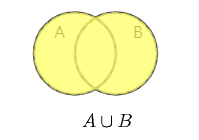

由所有属于集合$A$且同时属于集合$B$的元素组成的集合称为$A$与$B$的==交集==，记作$A \cap B$,即：

$$
A \cap B = \{ x\in A\  且\  x\in B\}
$$

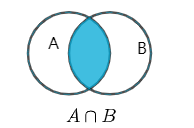

由所有属于集合$A$而不属于$B$的元素组成的集合称为$A$与$B$的差集，记作$A-B$，即：

$$
A-B=\{x\in A \ 且\ x\notin B\}
$$

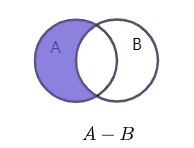

如果一个集合含有所研究问题所涉及的所有元素，那么称该集合为==全集==，通常记为$U$。

对于一个集合$A$，由全集$U$中不属于集合$A$的所有元素组成的集合称为集合$A$相对于全集$U$的==补集==，简称为集合$A$的补集，记作$C_uA或\bar{A}$,即：

$$
C_uA = \{ x \in U, 且 x\notin A\}
$$

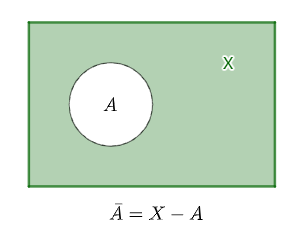

### 1.1.4 集合运算的基本性质

集合运算具有下列性质：

1. 交换律

   $$
   A\cap B=B\cap A\\A\cup B=B\cup A
   $$
2. 结合律

   $$
   A\cap (B\cap C)=(A\cap B)\cap C \\ A\cup (B\cup C)=(A\cup B)\cup C
   $$
3. 分配律

   $$
   A\cap(B\cup C)=(A\cap B)\cup(A\cap C)\\ A\cup(B\cap C)=(A\cup B)\cap(A\cup C)
   $$
4. 对偶律（又称德摩根律）

   $$
   \overline{A\cap B}=\overline{A}\cup\overline{B}\\
   \overline{A\cup B}=\overline{A}\cap\overline{B}
   $$
5. 吸收律

   $$
   A\cup (A\cap B)=A \\
   A\cap(A\cup B)=A
   $$
6. 幂等律

   $$
   A\cup A=A \\
   A\cap A = A
   $$
7. 0-1律

   $$
   A\cup \empty = \empty \\
   A\cap \empty = \empty \\
   A\cup X=X \\
   A \cap X = A
   $$
8. 对合律

   $$
   \begin{align}
   \overline{\empty} &=X \\
   \overline{X} &= \empty \\
   A\cup \overline{A} &= X \\
   A\cap \overline{A} &= \empty \\
   \overline{\overline{A}}&=A
   \end{align}
   $$

### 1.1.5 笛卡尔积

称集合$\{(x,y) | x\in A, y\in B\}$为集合$A$和集合$B$的==笛卡尔积==，又叫做==直积==，记为$A\times B$。

> @Question
>
> **例1**	设$A=\{-1, 1\}$, $B=\{1,2,3\}$,求$A\times B$。

> @Solution
>
> <b>解析</b>	$A\times B=\{(-1,1), (-1,2), (-1,3), (1,1), (1,2), (1,3)\}$,其图如下：
> 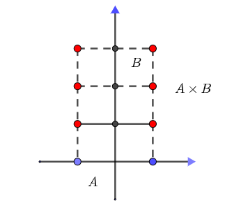
> 特别的，当$A$和$B$是连续的话，其笛卡尔乘积如下图:
> 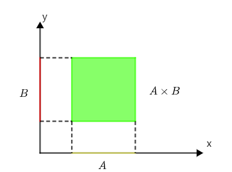

## 1.2 常量与变量 区间与邻域

### 1.2.1 常量与变量

在研究某一现象或研究某些问题的过程时，常常会遇到各种不同的变量，其中有的量在这个过程中保持不变，我们称之为==常量==；有的量在这个过程中是变化的，称之为==变量==。

### 1.2.2 区间

对于实数轴上的点来说，常见如下的区间：

| 区间名称   | 区间满足的不等式         | 区间的记号                         | 在数轴上的表示                                                                                                                               |
| ---------- | ------------------------ | ---------------------------------- | -------------------------------------------------------------------------------------------------------------------------------------------- |
| 闭区间     | $a\le x\le b$          | $[a,b]$                          | 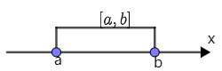                                                                     |
| 开区间     | $a<x<b$                | $(a,b)$                          | 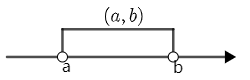                                                                     |
| 半开闭区间 | $a<x\le b$             | $(a,b]$或$[a,b)$               | 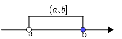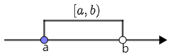 |
| 无限开区间 | $x>a$或$x<a$         | $(a,+\infty)$ 或$(-\infty, a)$ | 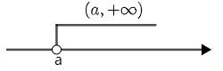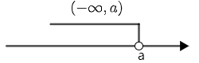 |
| 无限闭区间 | $x\ge a$ 或 $x\le a$ | $[a, +\infty)$或$(-\infty, a]$ | 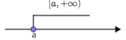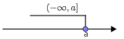 |

### 1.2.3 邻域

> @Definition
>
> **定义1.1**	设$a$和$\delta$是两个实数，且$\delta>0$,集合$\{x\in R| |x-a|\lt\delta\}$称为点$a$的$\delta$邻域，记为$U(a,\delta)$,点$a$称为此邻域的中心，$\delta$称为此邻域的半径。集合${x\in R|0\lt|x-a|<\delta}$称为点$a$的$\delta$去心邻域。通常，集合$\{x\in R| a-\delta\lt x\lt a\}$称为点$a$的$\delta$的左邻域；集合$\{x\in R| a\lt x\lt a+\delta\}$称为点$a$的$\delta$右邻域。
> 具体如下图：
> 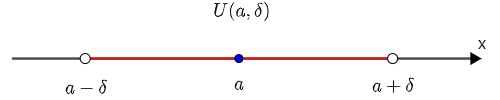
> 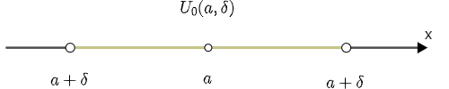
> 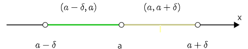

## 1.3 映射

### 1.3.1 映射的定义

> @Definition
>
> <b>定义1.2</b>	设$X$和$Y$是两个非空集合，如果存在一个法则 $f$，使得对 $X$ 中的每个元素 $x$，按法则 $f$，在$Y$中有唯一确定的元素 $y$ 与之对应，那么称$f$为从$X$到$Y$的映射，记作：
>
> $$
> f:X\rightarrow Y
> $$
>
> 其中 $y$ 称为元素 $x$ (在映射$f$下)的一个像，并记作$f(x)$，即
>
> $$
> y=f(x)
> $$
>
> 而元素$x$称为元素$y$(在映射$f$下)的一个原像；集合$X$称为映射$f$的定义域，记作$D_f$,即$D_f=X$;$X$中所有元素的像所组成的集合称为映射 $f$ 的值域，记作$R_f$或 $f(X)$ ,即
>
> $$
> R_f=f(X)=\{f(x)|x\in X\}
> $$

### 1.3.2 单射和满射

> @Definition
>
> **定义1.3**	设$f:A\rightarrow B$ 是映射，若对任意的$x_1,x_2\in A$,$f(x_1)=f(x_2)\Rightarrow x_1=x_2$,则称$f$为单射。若 $R_f=B$ ,则称$f$为满射。若 $f$ 既是单射，又是满射，则称 $f$ 为一一映射，又叫双射。

> @Definition
>
> **定义1.4**	设 $A$， $B$ 是两个集合，若存在一个一一映射 $\varphi:A\rightarrow B$, 则称集合 $A$ 与集合 $B$ 是等势的

### 1.3.3 逆映射和复合映射

设 $f$ 是 $X$ 到 $Y$ 的单射，则由定义，对每个 $y\in R_f$,有唯一的$x\in X$,使得 $f(x)=y$，于是，定义一个从$R_f$到$X$ 的新映射$g$ ,即

$$
g:R_f\rightarrow X,
$$

对每个$y\in R_f$,规定$g(y)=x$,这个$x$满足$f(x)=y$。这个映射$g$ 称为 $f$ 的逆映射，记作 $f^-1$ ,其定义域 $D_{f^{-1}}=R_f$,值域$R^{f^{-1}} = X$ 。

设有两个映射
$$
g:X\rightarrow Y_1, f:Y_2\rightarrow Z ,
$$

其中，$Y_1 \subset Y_2$,则由映射$g$和$f$可以定出一个从$X$ 到 $Z$ 的对应法则，它将每个 $x\in X$ 映射成 $f[g(x)]\in Z$ 。显然，这个对应法则确定了一个从$X$ 到$Z$ 的映射，这个映射称为映射$g$和$f$ 构成的复合映射，记作$f\circ g$,即：

$$
f\circ g : X\rightarrow Z, (f\circ g)(x)=f[g(x)],x\in X
$$

## 1.4 函数

### 1.4.1 函数的概念

> @Definition
> **定义1.5** 设数集$D\subset R$ ,则称映射 $f:D\rightarrow R$ 为定义在$D$上的函数，通常简记为
> $$
> y=f(x), x\in D
> $$
> 其中，$x$ 称为自变量，$y$ 称为应变量，$D$ 称为定义域，记作$D_f$,即$D_f=D$

### 1.4.2 函数的性质

> @Definition
> **定义1.6**  设$f(x)$是定义在区间$I$上的一个函数，若$\exists M>0$,使得$\forall x\in I$,恒有$|f(x)|\le M$恒成立，则称函数$f(x)$在区间$I$上==有界==，否则称$f(x)$ 在区间$I$ 上==无界==

> @Definition
> **定义1.7**  设函数$y=f(x)$,$\forall x_1, x_2\in D_f, x_1<x_2$
> * 若$f(x_1)\le f(x_2)(或f_1(x)\ge f_2(x))$,则称函数$f(x)$在区间$(a,)$内是==单调递增==（或==单调递减==）的；
>
> * 若$f(x_1)< f(x_2)(或f_1(x)>f_2(x))$,则称函数$f(x)$在区间$(a,)$内是==严格单调递增==（或==严格单调递减==）的；
>
>   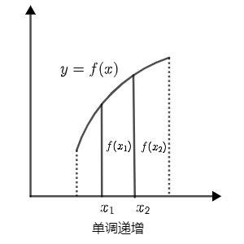
>
>   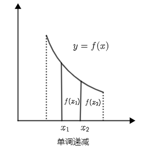

> @Definition
> **定义1.8** 设函数$f(x)$在一个关于原点对称的数集$D$上有定义，
> * 若$\forall x\in D$,均有 $f(-x)=f(x)$，则称$f(x)$为在$D$上的==偶函数==
>
> * 若$\forall x\in D$,均有 $f(-x)=-f(x)$，则称$f(x)$为在$D$上的==奇函数==
>
>   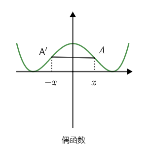
>
>   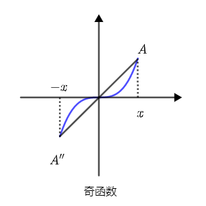

> @Definition
> **定义1.9** 设函数$f(x)$的定义域为$D_f$,若存在一个不为零的常数$T$,使得关系式
> $$
> f(x+T) = f(x),x+T\in D_f
> $$
> 对于定义域内任意$x$ 都成立，则$f(x)$称为==周期函数==，$T$称为$f(x)$的周期，通常所说的周期是指==最小正周期==。
>
> 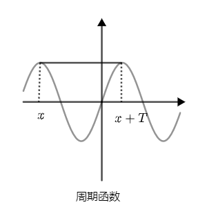
>  注意： 并非所有周期函数一定存在最小正周期，如：
>  $$
>  狄利克雷函数： y=f(x) = \begin{cases}1, \quad 当x为有理数\\ 0, \quad当x为无理数 \end{cases}
> $$

### 1.4.3 反函数

> @Definition
>
> **定义1.10**	设函数$f:D\rightarrow f(D)$是单射，则它存在逆映射$f^(-1):f(D)\rightarrow D$,称此映射$f^{-1}$为函数的==反函数==。

> @Theorem
>
> **定理1.1(反函数存在定理)**	若$y=f(x)$是定义在$D$上严格单调递增（减）函数，则它的反函数$y=f^{-1}$必定存在，且在$f(D)$上严格单调递增(减)。	

### 1.4.4 复合函数

> @Definition
>
> **定义1.11**	设函数$f(u)$的定义域为$D_f$,函数 $u=f(x)$的定义域为$D_g$,且其值域$R_g\subset D_f$,则由下式确定的函数
> $$
> y=f[g(x)],x\in D_g
> $$
> 称为由函数 $u=g(x)$与函数$y=f(u)$构成的==复合函数==，它的定义域为$D_g$,变量$u$称为==中间变量==。
>
> 函数$g$与函数$f$构成的复合函数，通常记为$f\circ g$ 即
> $$
> (f\circ g)(x)=f[g(x)]
> $$
> 

### 1.4.5 函数的运算

设函数$f(x),g(x)$的定义域依次为$D_1,D_2,D=D_1\cap D_2\neq \empty$,则这两个函数的四则运算如下：

| 运算   | 符号          | 详情                                                        |
| ------ | ------------- | ----------------------------------------------------------- |
| 和(差) | $f\pm g$      | $(f\pm g)(x)=f(x)\pm g(x), x\in D$                          |
| 积     | $f\cdot g$    | $(f\cdot g)(x)=f(x)\cdot g(x), x\in D$                      |
| 商     | $\frac{f}{g}$ | $(\frac{f}{g})(x)=\frac{f(x)}{g(x)},\{g(x)\neq 0, x\in D\}$ |

### 1.4.6 基本初等函数

常见的初等函数如下表：

| 名称         | 表达式                                                       | 定义域                             | 图形                                                         |
| ------------ | ------------------------------------------------------------ | ---------------------------------- | ------------------------------------------------------------ |
| 常量函数     | $y=c$                                                        | $-\infty<x<+\infty$                | 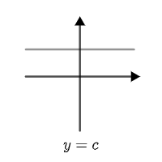 |
| 幂函数       | $y=x^a(a为常数)$                                             | $和a取值有关$                      | 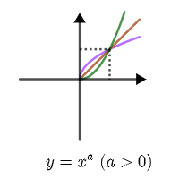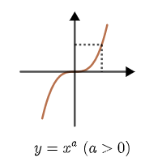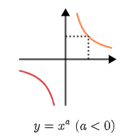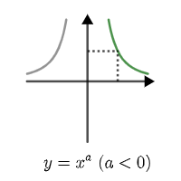 |
| 指数函数     | $y=a^x(a>0,a\neq 1)$                                         | $-\infty<x<+\infty$                | 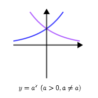 |
| 对数函数     | $y=log_ax(a>0,a\neq 1)$                                      | $0<x<+\infty$                      | 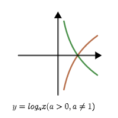 |
| 三角函数     | $y=\sin x$                                                   | $-\infty<x<+\infty$                | 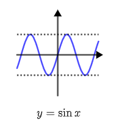 |
| 三角函数     | $y=\cos x$                                                   | $-\infty<x<+\infty$                | 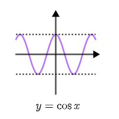 |
| 三角函数     | $y=\tan x$                                                   | $x\neq (2k+1)\frac{\pi}{2},k\in Z$ | 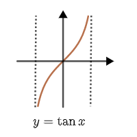 |
| 三角函数     | $y=\cot x$                                                   | $x\neq k\pi, k\in Z$               | 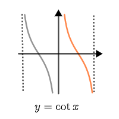 |
| 反三角函数   | $y=\arcsin x$  $y=\arccos x$                             | $-1\le x\le 1$                     | 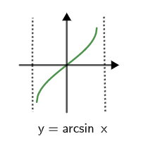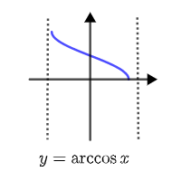 |
| 反三角函数   | $y=\arctan x$                                                | $-\infty<x<+\infty$                | 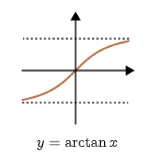 |
| 反三角函数   | $y=\arccot x$                                                | $-\infty<x<+\infty$                | 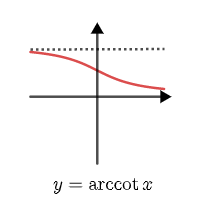 |
| 双曲函数     | $sh \ x = \frac{e^x-e^{-x}}{2}$ $ch \ x = \frac{e^x+e^{-x}}{2}$ | $-\infty<x<+\infty$                |  |
| 双曲正切     | $th \ x = \frac{e^x-e^{-x}}{e^x+e{_x}}$                      | $-\infty<x<+\infty$                | 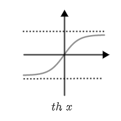 |
| 反双曲正弦   | $arsh\ x = ln(x+\sqrt{x^2+1})$                               | $-\infty<x<+\infty$                | 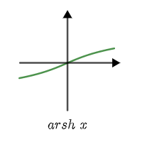 |
| 反双曲线余弦 | $arch\ x =ln(x+\sqrt{x^2-1})$                                | $1\le x<+\infty$                   |  |
| 反双曲线正切 | $arth\ x=\frac{1}{2}ln\frac{1+x}{1-x}$                       | $-1<x<1$                           | 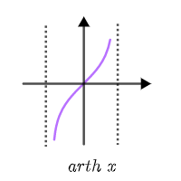 |

# 2 数列的极限

## 2.1 数列与极限

### 2.1.1 数列的概念

> @Definition
>
> **定义2.1**	若实值函数$f(n)$的定义域为全体正整数集合$N^+$,则称$f：N^+\rightarrow R$或$f(n)(n\in N^+)$为==数列==。
>
> 一般记$f(n)=a_n$，则数列$f(n)(n=1,2,...)$就可以写作$a_1,a_2,\dots,a_n,\dots$,简记为$\{a_n\}$,其中$a_n$称为该数列的==通项==。

### 2.1.2 数列极限的定义

1. 从代数角度出发：

> @Definition
>
> **定义2.2**	设$\{x_n\}$为一数列，如果存在常数$a$，对于任意给定的正数$\varepsilon$(不论它多么小)，总存在正整数$N$,使得当$n>N$时，不等式
> $$
> |x_n-a|<\varepsilon
> $$
> 都成立，那么就称常数$a$是数列$\{x_n\}$的==极限==,或者称数列${x_n}$收敛于$a$,记作
> $$
> \lim_{x\to \infty}x_n=a\quad 或\quad x_n\to a(n\to n)
> $$
> 如果不存在这样的常数$a$，就说数列$\{x_n\}$没有极限，或者说数列$\{x_n\}$是发散的、

2. 从几何角度出发

> @Definition
>
> **定义2.2'**	任给$\varepsilon >0$,若在$U(a,\varepsilon)$之外数列$\{a_n\}$中的项只有有限项，则称数列${a_n}$收敛于$a$。

### 2.1.3 数列的有界与无界

> @Definition
>
> **定义2.3**	对于数列$\{x_n\}$,若$\exists M>0$,且$M\in R$,使得对一切的$n=1,2,\dots$都有$|x_n|\le M$，则称数列$\{x_n\}$是==有界==的，否则称他是==无界==的。
>
> - 对于数列$\{x_n\}$,若$\exists M>0$,且$M\in R$,使得对一切的$n=1,2,\dots$都有$x_n\le M$，则称数列$\{x_n\}$有==上界==。
> - 对于数列$\{x_n\}$,若$\exists M>0$,且$M\in R$,使得对一切的$n=1,2,\dots$都有$x_n\ge M$，则称数列$\{x_n\}$有==下界==。
>
> 数列$\{x_n\}$有界的充要条件是既有上界又有下界。

### 2.1.4 子数列

> @Definition
>
> **定义2.4**	在数列$\{x_n\}$中保持原有的次序自左向右任意选取无穷多项$x_{n_k}$构成一个新的数列，称它为数列$\{x_n\}$的子列，记作$\{x_{n_k}\}$。

### 2.1.5 单调数列

> @Definition
>
> **定义2.5**	若数列$a_n$满足不等式$a_n\le a_{n+1}(a_n\ge a_{n+1})$,则称数列$\{a_n\}$为==递增(递减)数列==，递增数列和递减数列统称为单调数列。

## 2.2 收敛数列的性质

### 2.2.1 极限唯一性

> @Theorem
>
> **定理2.1**	若数列$\{x_n\}$收敛，则其极限唯一

### 2.2.2 有界性

> @Theorem
>
> **定理2.2**	若数列$\{x_n\}$收敛，则数列$\{x_n\}$有界。

### 2.2.3 保号性

> @Theorem
>
> **定理2.3**	如果$\lim_{x\to \infty}x_n=a$,若$a>0(或a<0)$,则$\exists N>0$,使得当$n>N$时，有$x_n>0(或x_n<0)$。

### 2.2.4 收敛数列与其子列的关系

> @Thorem
>
> **定理2.4**	如果数列$\{a_n\}$收敛于$a$，那么它的任何子列$\{x_{n_k}\}$都收敛，且极限也是$a$。

## 2.3 数列极限的运算

> @Theorem
>
> **定理2.5**	如果$\lim_{x\to \infty}a_n=A$,$\lim_{n\to \infty}b_n=B$,那么：
>
> 1. $\lim_{x\to\infty}(a_n+b_n)=A+B$
> 2. $\lim_{x\to\infty}(a_nb_n)=A*B$
> 3. $\lim_{x\to\infty}(\frac{a_n}{b_n})=\frac{A}{B}(B\neq 0)$

## 2.4 夹逼准则

> @Theorem
>
> **定理2.6**	若有数列$\{a_n\},\{b_n\}$都收敛于$a$，且数列$\{c_n\}$满足:存在正数$N_0\in N$,当$n>N$时，有$a_n\le c_n\le b_n$,则数列$\{c_n\}$收敛且$\lim_{x\to\infty}{c_n}=a$。

## 2.5 单调有界定理

在给出定理前先引入上下确界的概念

> @Definition
>
> **定义2.6**	给定一个数集$A$,若存在一个数$a$满足如下条件：
>
> 1. 集合$A$中的所有元素$x\le a$
>
> 2. 对任意给定的正数$\varepsilon >0$,$\exists x\in A$, 使得
>    $$
>    x>a-\varepsilon
>    $$
>    那么称$a$为数集$A$的==上确界==，记作$sup\ A$,类似的，可定义数集$A$的==下确界==，记作$inf \ A$。

> @Theorem
>
> **定理2.7（单调有界定理）**	在实数系中，有界且单调数列必有极限。	

## 2.6 柯西收敛准则

之前的单调有界定理只是给出了数列收敛的充分条件，下面是在实数集数列收敛的充要条件。

> @Theorem
>
> **定理2.8(柯西收敛准则)**	数列$\{a_n\}$收敛的充分必要条件是：对任给的$\varepsilon >0$,存在正整数$N$，使得当$n,m>N$时，恒有$|a_n-a_m|<\varepsilon$;或对任给的$\varepsilon >0$,存在正整数$N$，使得当$n>N$及任一$p\in N^+$,恒有$|a_{n+p}-a_n|<\varepsilon$。

# 3 函数的极限

## 3.1 自变量趋于有限数

> @Definition
>
> **定义3.1**	设函数$f(x)$在点$x_0$得到去心邻域$U^o(x_0,\var)$内有定义，$A$是一个确定的常数，若对$\forall\ \varepsilon>0 $,存在$\delta = \delta(\varepsilon)$ ,当$0<|x-x_0|<\delta$时，恒有
> $$
> |f(x)-A|<\varepsilon
> $$
> 则称$A$为函数$f(x)$在$x\to x0$是的==极限==，记为
> $$
> \lim_{x\to x_0}f(x)=A\ 或\ f(x)\to A(x\to x_0)
> $$

> @Definition
>
> **定义3.2**	设函数$f(x)$在点$x_0$处的去心邻域$U^0(x_0,\delta_1)$内有定义
>
> - 若$\forall\ \varepsilon > 0$,$\exist \delta_1>\delta>0$,当$x_0-\delta<x<x_0$时，恒有$|f(x)-A|<\varepsilon$,则称$A$为函数$f(x)$在$x$趋于$x_0$时的==左极限==，记作:$\lim_{x\to x_0^-}f(x)=A$
> - 若$\forall\ \varepsilon > 0$,$\exist \delta_1>\delta>0$,当$x_0<x<x_0+\delta$时，恒有$|f(x)-A|<\varepsilon$,则称$A$为函数$f(x)$在$x$趋于$x_0$时的==右极限==，记作:$\lim_{x\to x_0^+}f(x)=A$

> @Theorem
>
> **定理3.1**	设函数$f(x)$在点$x_0$处的去心邻域$U^0(x_0, \delta)$内有定义，则$\lim_{x\to x_0}$=A的充要条件是$\lim_{x\to x_0^-}=A$ 且 $\lim_{x\to x_0^+}=A$。

## 3.2 自变量趋于无穷大

> @Definition
>
> **定义3.3**	设函数$f(x)$在$(-\infty,+a)\cup(b,+\infty)$内有定义，其中$a,b$为有限数，$A$为一个确定的常数。若$\forall \ \varepsilon >0$,存在$X=X(\varepsilon)>0$,使得当$|x|>X$时，恒有$|f(x)-A|<\varepsilon$ ,则称$A$为函数$f(x)$在$x\to \infty$时的==极限==，记作$\lim_{x\to\infty}f(x)=A$

> @Definition
>
> **定义3.4**	设函数$f(x)$在$(b,+\infty)$有定义，$A$是一个确定的常数，若$\forall \ \varepsilon$,$\exist\ X=X(\varepsilon)$>0,使得当$x>X$时，恒有$|f(x)-A|<\varepsilon$ ,则称$A$为函数$f(x)$在$x\to +\infty$时的极限，记作$\lim_{x\to +\infty}f(x)=A$

> @Definition
>
> **定义3.5**	设函数$f(x)$在$(-\infty,a)$有定义，$A$是一个确定的常数，若$\forall \ \varepsilon$,$\exist\ X=X(\varepsilon)$>0,使得当$x<X$时，恒有$|f(x)-A|<\varepsilon$ ,则称$A$为函数$f(x)$在$x\to -\infty$时的极限，记作$\lim_{x\to -\infty}f(x)=A$

> @Theorem
>
> **定理3.2**	设函数$f(x)$在$(-\infty,a)\cup (b,+\infty)$内有定义，其中$a,b$为有限数，$A$为一个确定的常数，则$\lim_{x\to \infty}f(x)=A$的充要条件是$\lim_{x\to-\infty}f(x)=A$且$\lim_{x\to+\infty}f(x)$=$A$

> @Definition
>
> **定义3.5**	设函数$f(x)$在$(-\infty, a)$或$(b,+\infty)$内有定义，其中$a,b$为有限数，$c$为一个确定的常数。若$\lim_{x\to+\infty}f(x)=c$或$\lim_{x\to-\infty}f(x)=c$中有一个存在，则称直线$y=c$为曲线$y=f(x)$的**水平渐近线**。

## 3.3 函数极限的性质

### 3.3.1 唯一性

> @Theorem
>
> **定理3.3**	若有函数$f(x)$的极限存在，则该极限时是唯一的。

### 3.3.2 局部有限性

> @Theorem
>
> **定理3.4**	设$\lim_{x\to x_0}f(x)$存在，则函数$f(x)$在点$x_0$的某一去心邻域内有界。

### 3.3.3 夹逼准则

> @Theorem
>
> **定理3.5**	设函数$f(x),g(x),h(x)$在$U^0(x_0, \delta ^*)$内有定义，且满足:
>
> 1. $g(x)\le f(x)\le h(x)$
> 2. $\lim_{x\to x_0}h(x)=\lim_{x\to x_0}g(x)=A$
>
> 则$\lim_{x\to x_0}f(x)=A$

### 3.3.4 局部保号定理

> @Theorem
>
> **定理3.6**	设函数$f(x)$在$U^0(x_0,\delta)$内有定义，且$\lim_{x\to x_0}f(x)=A>0(或A<0)$ ,则存在$\varepsilon >0$,当$0<|x-x_0|<\varepsilon$时，有:
> $$
> f(x)<0 (或 f(x)<0)
> $$

从定理3.6，可以得到更强的结论：

> @Theorem
>
> **定理3.6'**	如果$\lim_{x\to x_0}=A(A\neq 0)$，那么就存在$x_0$的某一去心邻域$U^0(X_N)$,当$x\in U^0(x_0)$时，就有$|f(x)|>\frac{|A|}{2}$。

## 3.4 函数极限与数列极限的关系

> @Theorem
>
> **定理3.7(海涅归结原理)**	$\lim_{x\to x_0}=A$的充要条件是对任何以$x_0$为极限的数列$\{x_n\}(x_n\neq x_0)$都有$\lim_{x\to \infty}f(x_n)=A$	

## 3.5 函数极限运算法则

> @Theorem
>
> **定理3.8**	 设$\lim_{x\to x_0}f(x)=A$与$\lim_{x\to x_0}g(x)=B$都存在，则：
>
> 1. 对任意常数$k_1,k_2$,极限$\lim_{x\to x_0}[k_1f(x)\pm k_2g(x)]$存在，且
>    $$
>    \lim_{x\to x_0}[k_1f(x)\pm k_2g(x)]=k_1\lim_{x\to x_0}f(x)+k_2\lim_{x\to x_0}g(x)=k_1A+k_2B
>    $$
>
> 2. $\lim_{x\to x_0}[f(x)g(x)]$存在，且
>    $$
>    \lim_{x\to x_0}[f(x)g(x)]=[\lim_{x\to x_0}f(x)][\lim_{x\to x_0}g(x)]=AB
>    $$
>
> 3. $\lim_{x\to x_0}\frac{f(x)}{g(x)}=\frac{\lim_{x\to x_0}f(x)}{\lim_{x\to x_0}g(x)}=\frac{A}{B}(\lim_{x\to x_0}g(x) = B \neq 0)$

对于复合函数，有：

> @Theorem
>
> **定理3.9(复合函数的极限定理)**	设$\lim_{u\to u_0}f(u)=f(u_0)$,$u=g(x)$ 且 $u_0=$$\lim_{x\to x_0}g(x)$,则
> $$
> \lim_{x\to x_0}f[g(x)]=f(\lim_{x\to x_0}g(x))=f(u_0)
> $$

## 3.6 两个重要的极限

### 3.6.1 重要极限一

$$
\lim_{x\to 0}\frac{sinx}{x}=1
$$

### 3.6.2 重要极限二

$$
\lim_{x\to \infty}(1+\frac{1}{x})^x=e
$$

# 4 无穷小量和无穷大量

## 4.1 无穷小量

### 4.1.1 无穷小量定义

> @Definition
>
> **定义4.1**	如果函数$f(x)$当$x\to x_0(或x\to \infty)$时的极限为零，那么$f(x)$为当$x\to x_0$(或$x\to \infty$)时的==无穷小量==。
>
> 特别的，以零为极限的数列$\{x_n\}$称为$n\to \infty$的无穷小量。

### 4.1.2 无穷小量和极限的关系

> @Theorem
>
> **定理4.1**	在自变量的同一变化过程$x\to x^*$中，函数$f(x)$具有极限$A$的充要条件是$f(x)=A+\alpha$,其中$\alpha$是无穷小。
>
> 这里的$x^*$表示六中变化之一。

### 4.1.3 无穷小量的性质

> @Theorem 
>
> **定理4.2**	有限个无穷小量的和仍是无穷小量。

> @Theorem
>
> **定理4.3**	有限个无穷小量的乘积仍是无穷小量。

> @Theorem
>
> **定理4.4**	有界变量与无穷小量的乘积仍是无穷小量。

## 4.2 无穷大量

### 4.2.1 无穷大量的定义

> @Definition 
>
> **定义4.2**	
>
> 1. 若$\forall M>0$,$\exist \delta>0$,当$0<|x-x_0|<\delta$时，有$|f(x)|>M$,则称函数$f(x)$为过程$x\to x_0$的==无穷大==，记为:
>    $$
>    \lim_{x\to x_0}f(x)=\infty
>    $$
>
> 2. 若$\forall M>0,\exist \delta>0$,当$0<|x-x_0|<\delta$时，有$f(x)>M$，则称函数$f(x)$为过程$x\to x_0$的==正无穷大==。

### 4.2.2 垂直渐近线

> @Definition
>
> **定义4.3**	若在$\lim_{x\to a^+}f(x)=+\infty$,$\lim_{x\to x^+}f(x)=-\infty$,$\lim_{x\to a^-}f(x)=+\infty$,$\lim_{x\to a^-}f(x)=-\infty$中有一个成立，则称直线$x=a$为曲线$y=f(x)$的**垂直渐近线。**

## 4.3 无穷大量和无穷小量的关系

> @Theorem
>
> **定理4.5**	在自变量的同一变化过程中
>
> 1. 若$f(x)$是无穷小量，且$f(x)\neq 0$,则$\frac{1}{f(x)}$是无穷大量
> 2. 若$f(x)$是无穷大量，则$\frac{1}{f(x)}$是无穷小量

## 4.4 无穷小量的比较

### 4.4.1 无穷小量比较

> @Definition
>
> **定义4.4**	在自变量的同一变化过程中，设$\lim f(x)=0$,$\lim g(x)=0$
>
> 1. 若$\lim \frac{f(x)}{g(x)}=0$,则称$f(x)$是比$g(x)$==高阶的无穷小量==，记作$f(x)=o[g(x)]$
> 2. 若$\lim\frac{f(x)}{g(x)}=c\neq0$,则称$f(x)$与$g(x)$是同阶无穷小量，特别的，如果$c=1$，则称$f(x)$与$g(x)$是==等价无穷小量==，记为$f(x)\sim g(x)$
> 3. 若$\lim\frac{f(x)}{g(x)}=\infty$，则称$f(x)$是比$g(x)$低阶的无穷小量
> 4. 若$\lim\frac{f(x)}{[g(x)]^k}=c\neq0$,则称$f(x)$是$g(x)$的$k$阶无穷小量。

### 4.4.2 等价无穷小量替换

> @Theorem 
>
> **定理4.6(等价无穷小量替换定理)**	设在某一极限过程中，函数$f(x)$，$f_1(x)$,$g(x)$,$g(x_1)$都是无穷小量，且$f(x)\sim f_1(x)$,$g(x)\sim g_1(x)$,如果$\lim \frac{f(x)}{g(x)}$存在，则$\lim\frac{f_1(x)}{g_1(x)}$也存在，且
> $$
> \lim \frac{f(x)}{g(x)}=\lim \frac{f_1(x)}{g_1(x)}
> $$

###  4.4.3 常见无穷小替换

当$x\to 0$时，有以下常见的等价无穷小

1. $\sin x  \sim x$
2. $\tan x\sim x$
3. $1-\cos x\sim \frac{1}{2}x^2$
4. $\arcsin x\sim x$
5. $ln(1+x)\sim x$
6. $e^x-1\sim x$
7. $(1+x)^a\sim ax(a为任意实数)$

# 5 函数的连续性与间断点

## 5.1 连续函数的概念

> @Definiton
>
> **定义5.1**	设函数$y=f(x)$在点$x=x_0$的某$\delta$邻域$U^0(x_0, \delta)$内有定义，若当自变量的增量$\Delta x=x-x_0\to 0$时，函数的增量$\Delta y=f(x_0+\Delta x)-f(x_0)\to 0$,即
> $$
> \lim_{\Delta x\to 0}\Delta y=0
> $$
> 则称函数$f(x)$在点$x=x_0$处==连续==。

连续函数也可以如下定义：

> @Definition
>
> **定义5.2**	设函数$f(x)$在点$x=x_0$的某$\delta$邻域$U^0(x_0, \delta)$内有定义，若$\lim_{x\to x_0}=f(x_0)$,则称函数$f(x)$在点$x=x_0$处==连续==。

$\varepsilon -\delta$语言定义如下：

> @Definition
>
> **定义5.3**	若$\forall \varepsilon>0$,$\exist \delta>0$,当$|\Delta x|<\delta$时，恒有$|\Delta y|<\varepsilon$,则称函数$y=f(x)$在点$x=x_0$处连续。

> @Definition
>
> **定义5.4**	若$\forall \varepsilon>0$,$\exist \delta>0$,当$|x-x_0|<\delta$时，恒有$|f(x)-f(x_0)|<\varepsilon$,则称函数$y=f(x)$在点$x=x_0$处连续。

接下来介绍函数的左连续与右连续

> @Definition
>
> **定义5.5**	
>
> 1. 设函数$f(x)$在点$x=x_0$处的某$\delta$左邻域$x_0-\delta<x\le x_0$内有定义，若$\lim{x\to {x_0^-}}=f(x_0)$,则称函数$f(x)$在点$x_0$处==左连续==；
> 2. 设函数$f(x)$在点$x=x_0$处的某$\delta$右邻域$x_0\le x<x_0+\delta$内有定义，若$\lim{x\to {x_0^+}}=f(x_0)$,则称函数$f(x)$在点$x_0$处==右连续==；

$\varepsilon -\delta$语言定义如下：

> @Definition
>
> **定义5.6**	
>
> 1. 设函数$f(x)$在点$x=x_0$处的某$\delta$左邻域$x_0-\delta<x\le x_0$内有定义，若$\forall \varepsilon >0$,$\exist \delta>0$,当$x_0-\delta<x\le x_0$时，恒有$|f(x)-f(x_0)|<\varepsilon$ ,则称函数$f(x)$在点$x=x_0$处左连续。
> 2. 设函数$f(x)$在点$x=x_0$处的某$\delta$右邻域$x_0\le x<x_0+\delta$内有定义，若$\forall \varepsilon >0$,$\exist \delta>0$,当$x_0\le x<x_0+\delta$时，恒有$|f(x)-f(x_0)|<\varepsilon$ ,则称函数$f(x)$在点$x=x_0$处右连续。

类比数列，函数的连续与左右连续的关系如下：

> @Theorem
>
> **定理5.1**	函数$f(x)$在点$x=x_0$处连续的充要条件是函数$f(x)$在点$x=x_0$处既左连续又右连续，即
> $$
> \lim_{x\to x_0}f(x)=f(x_0) \Leftrightarrow \lim_{x\to x_0^+}f(x)=\lim_{x\to x_0^-}f(x)=f(x_0)
> $$

对于区间上的连续函数，有如下定义：

> @Definition
>
> **定义5.7**	如果函数$f(x)$在开区间$(a,b)$内的每一点处都连续，则称函数$f(x)$在开区间$(a,b)$内连续，记作$f(x)\in C_{(a,b)}$。

> @definition 
>
> **定义5.8** 如果函数$f(x)$在开区间$(a,b)$内的每一点处都连续，且在左端点右连续，在右端点处左连续，则称函数$f(x)$在闭区间$[a,b]$上连续，记作$f(x)\in C_{[a,b]}$。

## 5.2 连续函数的运算

### 5.2.1 连续函数的四则运算

> @Theorem
>
> **定理5.2**	设函数$f(x)$与$g(x)$在$x=x_0$处连续，则它们的和(差)$f(x)\pm g(x)$，积$f(x)g(x)$以及商$\frac{f(x)}{g(x)}(g(x)\neq 0)$ 在点$x-x_0$处都连续。

### 5.2.5 反函数与复合函数

> @Theorem
>
> **定理5.3(反函数的连续性定理)**	设函数$f(x)$在$[a,b]$上严格单递增(递减)且连续，同时$f(a)=\alpha$且$f(b)=\beta$,则其反函数$x=f^{-1}$在$[\alpha,\beta]或[\beta,\alpha]$上严格单调递增(或递减)且连续。

由上述定理，可以推出若外函数连续且内函数连续，则其复合函数也是连续的。

> @Theorem
>
> **定理5.4**	一切初等函数在其定义域内连续。

## 5.3 函数的间断点

函数不连续点称为函数的==间断点==。

### 5.3.1 第一类间断点

设点$x=x_0$是函数的间断点，如果函数$f(x)$在点$x=x_0$处的两个单侧极限$\lim_{x\to x_0^+}$与$\lim_{x\to x_0^-}$都存在，则称该点$x=x_0$为函数的第一类间断点。

第一类间断点包括可去间断点和跳跃间断点：

1. 单侧存在且相等的称为可去间断点
2. 单侧存在但不相等称为跳跃间断点

### 5.3.2 第二类间断点

设$x=x_0$是函数$f(x)$的间断点，如果函数$f(x)$在$x=x_0$点处的单侧极限$\lim_{x\to x_0^+}$与$\lim_{x\to x_0^-}$至少有一个不存在，则称点$x=x_0$为函数$f(x)$的第二类间断点。

- 只要有一个单侧极限为$\infty$的间断点就称为函数的==无穷间断点==。
- 如果函数在点呈现震荡现象，则称为震荡间断点。

## 5.4 闭区间上连续函数的性质

### 5.4.1 最大值与最小值

> @Definition
>
> **定义5.9**	设函数$f(x)$在区间$I$上有定义，若存在点$x_0\in I$，使得$\forall x\in I$,都有$f(x)\le f(x_0)(或f(x)\ge f(x_0))$,则称函数$f(x_0)$为函数$f(x)$在区间$I$上的最大值（或最小值），记作$\max_{x\in I}\{f(x)\}=f(x_0)$(或$\min_{x\in I}\{f(x)\}=f(x_0)$) 。

> @Theorem
>
> **定理5.5(最大值与最小值定理)**	若函数$f(x)$在闭区间$[a,b]$上连续，则函数$f(x)$在$[a,b]$上必取到最大值与最小值。	

### 5.4.2 零点存在

> @Theorem
>
> **定理5.6（零点定理）**	设函数$f(x)$在闭区间$[a,b]$上连续，且$f(a)\cdot f(b)<0$,则存在$\xi \in (a,b)$,使得$f(\xi)=0$。

### 5.4.3 介值定理

> @Theorem
>
> **定理5.7（介值定理）**	若函数$f(x)$在闭区间$[a,b]$上连续，$f(a)\neq f(b)$,则对于介于$f(a)$与$f(b)$之间的任意常数$c$，存在$\xi \in (a,b)$，使得$f(\xi)=c$。
