# 1. 计算机的发展史

## 1.1 计算机及的产生和发展

### 1.1.1 第一代电子管计算机

1. ENIAC 于1946年交付使用，采用十进制运算，含有18000多个电子管，耗电量高达150千瓦，重量达到30吨，占地面积为1500平方英尺，每秒可进行5000多次的加法运算。

2. 1946年冯·诺依曼设计了一台存储程序的计算机ISA

   

### 1.1.2 第二代晶体管计算机

1. 1947年在贝尔实验室成功用半导体硅作为基片，制成第一个晶体管，它具有体积小、低耗能以及载流子高速运行的特点。
2. 20世纪50年代后，出现了一场一晶体管代替电子管的革命

### 1.1.3 第三代集成电路计算机

1. 当集成电路制造技术出现后，利用光刻技术把晶体管、电阻、电容等构成的单个电路全部制作在一块极小的硅片上。
2. 进一步发展，实现将成百上千个这样的门电路全部制作在一块极小的硅片上，并引出外部连接的引线，大大缩小了计算机的体积，减少耗电量。
3. 具有代表的是IBM的System/360和PDP-8

以下是个阶段硬件技术对计算机的影响

| 发展阶段 |   时间    |      硬件技术      | 速度(次/每秒) |
| :------: | :-------: | :----------------: | :-----------: |
|    一    | 1946-1957 |       电子管       |     40000     |
|    二    | 1958-1964 |       晶体管       |    200000     |
|    三    | 1965-1971 | 中、小规模集成电路 |    1000000    |
|    四    | 1972-1977 |   大规模集成电路   |   10000000    |
|    五    | 1978-现在 |  超大规模集成电路  |   100000000   |

## 1.2. 微型计算机的出现和发展

1. 集成电路技术把计算机的控制单元和算逻单元集成到一个芯片上，制成了微处理器芯片。

2. Moore定律：微芯片上集成的晶体管数每3年翻两番

3. Intel典型产品如下;

   |      产品名       | 位数 | 发布时间 | 晶体管数 |
   | :---------------: | :--: | :------: | :------: |
   |       8080        |  8   |   1974   |          |
   |       8086        |  16  |   1978   |  2.9万   |
   |       8088        |  16  |   1979   |  2.9万   |
   |       80286       |  16  |   1982   |  13.4万  |
   |       80386       |  32  |   1985   |  27.5万  |
   |       80486       |  32  |   1989   |  120万   |
   |      Pentium      |  32  |   1993   |  310万   |
   |    Pentium Pro    |  64  |   1995   |  550万   |
   | Pentium Ⅱ |  64  |   1997   |  750万   |
   | Pentium Ⅲ |  64  |   1999   |  950万   |
   | Pentium Ⅳ |  64  |   2000   |  4200万  |

4. 21世纪微处理器的发展重点：

   - 进一步提高复杂度来提高处理器性能
   - 通过线程、进程级并行的开发提高处理器的性能
   - 将存储器集成到处理芯片内来提高处理器性能
   - 发展嵌入式处理器

   

## 1.3 软件技术的发展

1. 早期（机器语言）$\to$ 符号语言和汇编语言$\to$ 面向问题的高级语言。高级语言发展经历了几个阶段;
   - 第一阶段：面向科学计算和工程计算，代表FORTAN
   - 第二阶段：结构化程序设计，代表PASCAL
   - 第三阶段：面向对象程序设计，代表C++、Java
2. 软件发展有以下特点
   - 开发周期长
   - 制作成本昂贵
   - 检测软件产品质量的特殊性

# 2. 计算机的应用

## 2.1 科学计算和数据处理

pass

## 2.2 工业控制

pass

## 2.3 网络技术的应用

1. 电子商务
2. 网络教育
3. 敏捷制造

## 2.4 虚拟现实

pass

## 2.5 办公自动化和管理信息系统

pass

## 2.6 CAD/CAM/CIMS

pass

## 2.7 多媒体技术

pass

## 2.8 人工智能

pass

# 3. 计算机展望

1. 计算机具有类似人脑的一些智能功能，要求计算机的速度要足够块
2. 芯片集成度的提高时受以下三方面的限制
   - 芯片集成度受物理极限的约束
   - 按几何级数递增的制作成本
   - 芯片的功耗、散热、线延迟
