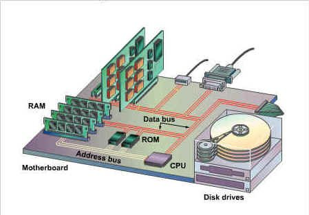

# 1. 总线的基本概念

1. 计算机系统五大部件之间的相互连接方式有两种：

   - 各部件之间使用单独的连线，称为分散连接

   - 将各部件连接到一组公共信息传输线上，称为总线连接

2. 总线是连接多个部件的信息传输线，是各部件共享的传输介质，在某一时刻，只允许有一个部件向总线发送信息；而多个部件可以同时从总线上接受相同的信息。

3. 总线实际上是由许多传输线或通路组成，每条线可以一位一位地传输二进制代码，一串二进制代码可在一段时间内逐一传输完成。

# 2. 总线的分类

总线从不同的角度有不同的分法。

按照传输方式

- 并行传输总线

  在并行传输总线中，又可以按照传输数据的位宽分为8位，16位，32位，64位等

- 串行传输总线

按总线的使用围

- 计算机（包括外设）总线
- 测控总线
- 网络通信总线

## 2.1 片内总线

片内总线是指芯片内部的总线。

例如：在CPU芯片内部，寄存器与寄存器之间、寄存器与算逻单元ALU之间都由片内总线连接。

## 2.2 系统总线

系统总线是指CPU、主存、I/O设备（通过I/O接口）各大部件之间的信息传输线。按传输信息的不同，可以划分为以下三类；

1. 数据总线

   数据总线用来传输各功能部件之间的数据信息，它是双向传输总线，其位数与机器字长、存储字长有关。

   数据总线的位数称为数据总线宽度。

2. 地址总线

   地址总线主要用来指出数据总线上的源数据或目的数据在主存单元的目的地址或I/O设备的地址。

   地址总线的位数与存储单元的个数有关

3. 控制总线

   控制总线是用来发出各种控制信号的传输线。常见的控制信号如下：

   - 时钟：用来同步各种操作
   - 复位：初始化各种同步操作
   - 总线请求：表示某部件需要获得总线的使用权
   - 总线允许：表示需要获得总线使用权的部件已获得了控制权
   - 中断请求：表示某部件提出中断请求
   - 中断相应：表示中断请求已被接收
   - 存储器写：将数据总线上的数据写至存储器的指定地址单元内
   - 存储器读：将指定存储单元中的数据读到数据总线上
   - I/O读：从指定的I/O端口将数据读到数据总线上
   - I/O写：将数据总线上的数据传输到指定的I/O端口内
   - 传输响应：表示数据已被接收，或已将数据送至数据总线上

## 2.3 通信总线

   用于计算机系统之间或计算机系统与其他系统（如控制仪表、移动通信等）之间的通信，按照传输方式可以分为两种：

- 串行通信：数据在单条1位宽的传输线上，一位一位地按顺序分时传送。
- 并行通信：数据在多条并行1位宽的传输线上，同时由源传送到目的地。

# 3. 总线特性及性能指标

## 3.1 总线特性

从物理角度来看，总线由许多导线直接印刷在电路板上，延伸到各个部件。

总线的特性包括：

1. 机械特性

   总线在机械连接方式上的一些性能，如：几何尺寸、形状、引脚个数以及排列顺序等。

2. 电器特性

   总线上的每一根传输线上信号的传递方向和有效电平范围。通常规定由CPU发出的信号称为输出信号，送入CPU的信号称为输入信号。

3. 功能特性

   总线中每根传输线的功能

4. 时间特性

   总线中的任一根线在什么时间内有效。

## 3.2 总线性能指标

总线的性能指标如下：

1. 总线宽度：通常是指数据总线的根数，用bit(位)表示。

2. 总线带宽：总线的数据传输速率，即单位时间内总线上传输数据的位数，通常用每秒传输信息的字节数来衡量，单位用MBps(兆字节每秒)表示。

3. 时钟同步/异步：总线上的数据与时钟同步工作的总线称为时钟同步，与时钟不同步工作称为异步总线

4. 总线复用：一条信号线上分时传送两种信号。

5. 信号线数：地址总线、数据总线和控制总线三种总线数的总和

6. 总线控制方式：包括突发工作、自动配置、仲裁方式、逻辑方式、计数方式等

7. 其他指标

   - 负载能力

     即驱动能力，指的是当总线接上负载后，总线输入输出的逻辑电平是否能保持在正常的额定范围内。

   - 电源电压

   - 总线宽度能否扩展

## 3.3 总线标准

所谓总线标准，可视为系统与各模块、模块与模块之间的一个互连的标准界面。

目前流行的总线标准有以下几种：

1. ISA总线

   - 使用独立于CPU的总线时钟
   - 没有支持总线仲裁的硬件逻辑，不能支持多台主设备系统
   - ISA上所有数据的传送必须通过CPU或DMA接口来管理

2. EISA总线

   - 在ISA基础上扩充开发的总线标准，兼容ISA
   - 从CPU中分离出总线控制权
   - 支持多个总线主控制器和突发方式

3. VESA(VL_BUS)总线

   - 是局部总线标准，在系统外为两个以上模块提供的高速传输信息通道
   - 将高速I/O设备直接挂在CPU上，实现高速数据交换

4. PCI总线

   特点：

   - 高性能：是一种不依附于某个具体处理器的局部总线；为系统提供了高速的数据传输通道；支持突发工作方式。

     ​				突发工作：若被传送的数据在主存中连续存放，则在访问此组数据时，只需要给出第一个数据的地址，占用一个时钟周期，其后每个数据的传送各占用一个时钟周期，不必每次给出各个数据的地址。

   - 具有良好兼容：PCI总线部件和插件接口相对于处理器是独立的。与ISA,EISA均可兼容。

   - 支持即插即用

   - 支持多主设备能力： 允许任何主设备和从设备（对总线没有控制权的设备）之间实现点到点存取。

   - 提供数据和地址奇偶校验功能

   - 支持两种电压标准：5V和3.3V

   - 可扩充性好

   - 软件兼容性好

   - 采用多路复用技术

5. AGP总线

   - 显卡专用的局部总线
   - 定义了“双激励”传输：能在一个时钟的上、下沿双向传递数据

6. RS-232C总线

   - 是一种串行通信总线标准

   - 用于数据终端设备(DTE)和数据通信设备(DCE)之间的标准接口

     

    

   

7. USB总线

   通用串行总线，主要特征：

   - 具有真正的即插即用特征
   - 具有很强的连接能力
     1. 使用USB HUB 实现系统拓展，最多可以连接127个外设到同一系统

     2. 标准USB电缆长度为3m,低速方式为5m,可以通过HUB或中继器使传送距离达到30m

    

   - 数据传输速率有两种
   - 标准统一
   - 连接电缆轻巧，电源体积小
   - 生命力强

   

### 4. 总线结构

## 4.1 单总线

单总线将CPU、主存、I/O设备（通过I/O接口）都挂在一组总线上，允许I/O设备之间、I/O设备与CPU之间或I/O设备与主存之间直接交换信息。

## 4.2  多总线结构

1. 双总线

   将速度较低的I/O设备从单总线上分离出来，形成主存总线和I/O总线分开的结构。

   上图中的通道是一个具有特殊功能的处理器，CPU将一部分功能下放给通道，使其对I/O设备具有统一管理的功能。

   

2. 三总线

   将速率不同的I/O设备进行分类，然后连接到不同的通道上，发展形成多总线结构。

   

   上图中的各个总线：

   - 主存总线：用于CPU与主存之间的传输

   - I/O总线：供CPU与各类I/O设备之间传递信息
   
   - DMA总线：用于高速设备（磁盘、磁带）与主存之间直接交换信息。
   
    上述三总线结构中,任一时刻只能使用一种总线;主存总线与DMA总线不能同时对主存进行存取;I/O总线只有在CPU执行I/O指令时才能用到。
   
   下面是另一种三总线结构：
   
   
   
   上述结构有以下特点：
   
   - 处理器与Cache之间有一条局部总线，Cache的控制器还直接连接到系统总线上，Cache可以通过系统总线与主存传输信息，I/O设备与主存之间的传输不必通过CPU
   - 还有一条拓展总线，将局域网、小型计算机接口（SCSI）、调制解器（Modem）以及串行接口连接起来，通过这些接口又可以与各类I/O设备连接
   - 拓展总线通过拓展总线接口与系统总线相连，实现信息传递
   
3. 四总线

   

   增加了一条与计算机系统紧密相连的高速总线。在高速总线上挂接了一些高速I/O设备，它们通过Cache控制机构中的高速总线桥或高速缓冲与系统总线和局部总线相连，使得高速设备与CPU根密切。
   
   而低速设备仍然挂在拓展总线上。

## 4.3 总线结构举例

1. 传统微型计算机的总线结构

   

2. VL-BUS 局部总线结构

   

3. PCI总线结构

4. 

5. 多层PCI总线结构

6. 

# 5. 总线控制

## 5.1 总线判优控制

总线上所连接的各类设备，按照对总线有无控制功能可分为主设备（模块）和从设备（模块）。主设备对总线由控制权，从设备只能相应从主设备发来的总线命令，对总线没有控制权。

总线上的信息是由主设备启动的，如果某个主设备想要和另一个设备（从设备）进行通信，首先由主设备发出总线请求信号，若多个设备同时要使用总线时，就由总线控制器的判优、仲裁逻辑按一定的优先等级确定哪个设备能使用总线。

总线判优控制分为：

- 集中式：将控制逻辑集中在一处
- 分布式：将控制逻辑分散在与总线连接的各个部件上

常见的集中控制优先权仲裁方式有：

1. 链式查询

   

   - 控制总线有3根用于总线控制(BS总线忙、BR总线请求、BG总线同意)
   - BG是串行的从一个I/O接口传到下一个I/O接口如果BG到达的接口有总线请求，BG信号就不往下传
   - 离总线控制部件近的优先级高，容易扩充，但对电路故障敏感；优先级别低的很难获得请求

2. 计时器定时查询

   

   - 多了一组设备地址线，需要$\log_2n$根线，$n$是允许接纳的最大设备数
   - 总线控制部件接收到由BR送来的总线请求信号后，在总线未被使用(S=0)的情况下，总线控制器中的计数器开始计数，并通过设备地址线，向各设备发出一组地址信号，当某个占用总线的设备地址与计数值一致时，获得总线占用权，此时终止计数
   - 计数可以从“0”开始，也可以由程序设置，故优先顺序可变

3. 独立请求方式

   

   - 每台设备都有一对请求线BR和总线同意线BG，设备使用总线时，发出该设备的请求信号
   - 总线控制部件有一排电路，根据优先次序确定响应那一台设备的请求
   - 响应速度快、优先次序控制灵活；但控制线数量多，总线控制复杂

## 5.2 总线通信控制

通常将完成一次总线操作的时间称为总线周期，可分为：

1. 申请分配阶段：由所需使用总线的主模块（或主设备）提出申请，经总线仲裁机构决定下一传输周期的总线使用授权于某一申请者
2. 寻址阶段：取得了使用权的主模块通过总线发出本次要访问的从模块（或从设备）的地址及有关命令，启动参与本次传输的从模块
3. 传数阶段：主模块和从模块进行数据交换，数据由源模块发出，经数据总线流入目的模块
4. 结束阶段：主模块的有关信息均从系统总线上撤除，让出总线的使用权

总线通信控制主要解决通信双方如何获知传输开始和传输结束，以及通信双方如何协调如何配合，通常由如下的四种方式：

1. 同步通信

   通信双方由统一时标控制数据传送。时标通常由CPU的总线控制部件发出送到总线上的所有部件；也可以由每个部件各自的时序发生器发出，但是必须由总线控制部件发出的时钟信号对它们进行同步

   读命令：

   

   - $T_1$:	主模块发出地址
   - $T_2$:   主模块发出读命令
   - $T_3$:   从模块提供数据
   - $T_4$:   主模块撤销读命令，从模块撤销数据

   写命令：

   

   - $T_1$: 	主模块发出地址
   - $T_{1.5}$:  主模块提供数据
   - $T_2$:     主模块发出写命令，从模块接收到命令后，必须在规定的时间内将数据总线上的数据写到地址总线所指明的单元中
   - $T_4$:     主模块撤销写命令和数据等信号    

2. 异步通信

   异步同行没有公共的时钟标准，采用应答方式（又称握手方式），即当主模块发出请求信号时，一直等待从模块反馈回来“响应”信号后，才开始通信。

   此时要求主、从模块之间增加两条应答线。

   异步通信可分为以下三种：

   

   - 不互锁方式
   
     - 主模块：发出信号后，经过一段时间，确认从模块收到请求后便撤销请求信号
     - 从模块：接收到请求信号后，在条件允许时间发出回答信号且经过一段时间确认主模块已收到回答信号后自动撤销回答信号。

   - 半互锁方式
   
     - 主模块：发出信号请求后，必须待接到从模块的回答信号后在撤销其请求信号，有互锁关系
     - 从模块：接到请求信号后发出回答信号，但不必等待获知主模块的请求信号已经撤销，而是隔一段世间后自动撤销其回答信号。

   - 全互锁方式
   
     - 主模块：发出请求信号，必须等待从模块回答后再撤销其请求信号
     - 从模块：发出回答信号，必须待获知主模块请求信号已经撤销后，在撤销其回答信号。

异步串行通信的数据传输速率用波特率来衡量。波特率是单位时间内传送二进制数据的位数，单位用bps(位/秒)表示，记作波特。

3. 半同步通信

   半同步增设了一条“等待”($\overline{WAIT}$)相应信号线，采用插入时钟（等待）周期的措施来协调通信双方的配合问题。

   

   以输入数据为例：

   - $T_1$: 主模块发出地址信息
   - $T_2$: 主模块发出命令
   - 当$\overline{WAIT}$为低电平是，进入等待，$T_W$的宽度与$T$的宽度一致
   - $\vdots$
   - $T_3$:   从模块提供数据
   - $T_4$:   主模块撤销读命令，从模块撤销数据

4. 分离式通信

   思想：将一个传输周期（或总线周期）分解为两个子周期，在第一个子周期中，主模块A在获得总线的使用权后将命令、地址以及其他有关信息，包括该主模块编号发送到系统总线上，经总线传输后，由有关从模块B接收下来。主模块一旦发送完成，立即放弃总线使用权。

   在第二个子周期中，当B模块收到A模块发来的有关命令信号后，经选择、译码、读取等一系列内部操作后，将A模块所需的数据准备好，让后由B模块申请总线使用权，获准后即可将A模块的编号、B模块的地址、A模块所需的数据等一系列信息送到总线上，供A模块接收。

   这种通信的特点：

   - 各模块想要占用总线使用权都必须提出申请
   - 在得到总线使用权后，主模块在限定时间内向对方传送信息，采用同步方式传送，不在等待对方的回答信号
   - 各模块在准备数据的过程中都不占用总线
   - 总线被占用时都在做有效工作，或者通过它发送命令，或者通过它传送数据。

