#  1.  概述

## 1.1 输入输出系统的发展状态

### 1.1.1 早期阶段

早期的I/O设备种类较少，I/O设备与主存交换信息必须通过CPU，如下图：

这种I/O设备具有如下特点：

- 每个I/O设备都必须配有一套独立的逻辑电路与CPU相连，用来实现I/O设备与主机之间的信息交换，线路十分散乱、复杂

- 输入输出过程是穿插在CPU执行程序之中进行的，当I/O设备与主机交换信息时，CPU不得不停止各种运算，因此，I/O设备与CPU是按串行方式工作的，极为浪费时间

- 每个I/O设备的逻辑控制电路与CPU的控制器紧密构成一个不可分割的整体，它们彼此依赖，相互联系，因此，增添、撤减或更换I/O设备非常困难。

  

### 1.1.2  接口模块和DMA阶段

这个阶段的I/O设备通过接口模块与主机连接，计算机采用了总线结构。

上图中，接口设有数据通路和控制通路，有以下作用：

- 数据经过接口既起到缓冲作用，又可以完成串-并变换
- 控制通路用以传送CPU向I/O设备发出的各种控制命令，或使CPU接受来自I/O设备的反馈信号
- 有些接口能满足中断处理的要求，使I/O设备与CPU可以按并行方式工作。
- 采用接口技术还可以使多台I/O设备分时占用总线，使多台I/O设备相互之间也可以实现并行工作

这个阶段实现了CPU和I/O设备并行工作，但是在主机和I/O设备交换信息时，CPU要中断现行程序。

接下来出现了直接存储器存取(DMA)技术，特点是I/O设备与主存之间有一条直接数据通路，I/O设备可以与主存交换信息，使CPU在I/O设备与主存交换信息时能继续完成自身的工作。

### 1.1.3 具有通道结构的阶段

在大中型计算机中，若仍然采用DMA方式会出现一系列问题：

1. 如果每台I/O设备都配有专用的DMA接口，增加了硬件成本，而且解决多个DMA接口同时访问主存的冲突问题很复杂
2. CPU需要对众多的DMA接口进行管理，同样会占用CPU的工作时间，因频繁进入周期挪用阶段影响效率

这时出现了I/O通道的方式来进行数据交换：

- 通道是用来负责管理I/O设备以及实现主存与I/O设备之间交换信息的部件
- 通道有专用的通道指令，能独立地执行用通道指令所编写的输入输出程序
- 依据CPU的I/O指令进行启动、停止或改变工作状态，从属于CPU的专用处理器
- 依赖通道管理的I/O设备在与主机交换信息时，CPU不直接参与

### 1.1.4 具有I/O处理机的阶段

I/O处理机又称为外围处理机，它基本独立于主机工作，既可以完成I/O通道要完成的I/O控制，又可完成码制变换、格式处理、数据块检错、纠错等工作。

## 1.2 输入输出系统的组成

输入输出系统由I/O软件和I/O硬件两部分完成。

1. I/O软件

   软件部分的主要任务是：

   - 将用户编制的程序(或数据)输入主机内
   - 将运算结果输送给用户
   - 实现输入输出系统与主机工作的协调

   当使用接口模块时，需要用到机器指令系统中的I/O指令及系统软件管理程序；当使用通道机管理方式时，需要I/O指令、通道指令以及相应的操作系统。

   - I/O指令

     

     I/O指令可以和其他机器指令的字长相等，但它还应该能反映CPU与I/O设备交换信息的各种特点，如：对多台I/O设备的选择；对不同设备应该做哪些具体操作等。

     上图中：

     - 操作码：可以作为I/O指令与其他指令的判别；

     - 命令码： 体现I/O设备的具体操作
     - 设备码： 多台I/O设备的选择码

     I/O指令一般有如下几种情况：

     - 将数据从I/O设备输入主机
     - 将数据从主机输入至I/O设备
     - 状态测试
     - 形成某些操作命令

   - 通道指令

     -  一般用以指明参与传送的数据组在主存中的首地址；
     - 指明需要传送的字节数或所传送数据组的末地址
     - 指明所选设备的设备码及完成各种操作的命令码
     - 又称为通道控制字(CCW) ,是通道用于执行I/O操作的指令，由通道从主存中取出并执行。
     - 通道程序由通道指令组成，完成某种外围设备与主存之间传送信息的操作

     

     I/O指令和通道指令的区别：

     I/O指令是CPU系统指令的一部分，是CPU用来控制输入输出操作的指令,由CPU译码后执行。I/O指令不实现I/O数据传送，主要完成开启、停I/O设备，查询通道和I/O设备的状态及控制通道所做的其他操作。

     而通道指令时来执行I/O操作，如读、写磁带走带及磁盘找道等。

2. I/O硬件

   在带有I/O接口系统中，一般包括接口模块及I/O设备两大部分；还包括许多数据传送通路和有关数据，包括控制信号通路及其相应的逻辑电路。
   
   下面是具有通道的I/O系统的示意图：
   
   

## 1.3 I/O设备与主机的联系方式

### 1.3.1 I/O设备编址方式

通常将I/O设备码看做地址码，对I/O地址码的编址可采用两种编码方式：

- 统一编址

  将I/O地址看做存储器地址的一部分

- 不统一编址

  I/O地址和存储器地址是分开的，所有对I/O设备的访问必须有专用的I/O指令。

### 1.3.2 设备寻址

当要启动某一设备时，可由I/O指令的设备码字段直接指出要该设备的设备号。

通过该接口电路的设备选择电路，即可选中要交换信息的设备。

### 1.3.3 传送方式

- 在一瞬间，$n$ 位信息同时从CPU输出至I/O设备，或由I/O设备输入到CPU，这种传送方式称为并行传送。特点是传送速度快，但要求的数据线多。
- 在一瞬间只传送一位信息，在不同时刻连续逐位传送一串信息，这种传送方式称为串行传送。特点是传送速度慢，但至需要一根数据线和一个地址线。

### 1.3.4 联络方式

I/O设备与主机之间必须相互了解彼此当时所处的状态，如：是否可以传送、传送是否已结束等。按I/O设备工作的速度不同，可分为三种联络方式：

- 立即响应方式

  一些工作速度十分慢的I/O设备，当它们与CPU发生联系时，通常都已使其处于某种等待状态，只要CPU的I/O指令一到，它们便立即响应

- 异步工作采取应答信号联络

  当I/O设备与主机工作速度不匹配时，通常采用异步工作方式。

  

  其工作如下：

  1. 当CPU将数据输出到I/O接口后，接口立即向I/O设备发出一个"Ready"信号
  2. I/O设备收到“Ready"信号后，立即从接口中取出数据，接着向接口回发一个”Strobe“ 信号，并让接口转告CPU，接口中的数据已被取走
  3. 一旦数据被取走，接口便向I/O设备发出"Ready"信号，通知I/O设备，数据已被取走，可继续送数据。

- 同步工作采取同步时标联络

  同步工作要求I/O设备与CPU的工作速度完全同步；联络之间还得配有专用电路，用以产生同步时标来控制同步工作。

### 1.3.5 I/O设备与主机的连接方式

I/O设备与主机的连接方式主要有两种：

- 辐射式

  

  要求每台I/O设备都有一套控制线路和一组信号线

- 总线式

  通过一组总线(包括地址线、数据线、控制线)，将所有的I/O设备与主机连接。

## 1.4  I/O设备与主机信息传送的控制方式

### 1.4.1 程序查询方式

程序查询方式是由CPU通过程序不断查询I/O设备是否已经做好准备，从而控制I/O设备与主机交换信息。这种方式要求I/O接口内设置一个能反映I/O设备是否准备就绪的转台标志。

### 1.4.2  程序中断方式

CPU在启动I/O设备后，不查询设备是否已准备就绪，继续执行自身程序，只是当I/O设备准备就绪并向CPU发出中断请求后才予以响应。

下面是程序中断方式动I/O设备读取数据块到主存的程序流程:

### 1.4.3 DMA方式

主存与I/O设备之间有一条数据通路，主存与I/O设备交换信息时，无需调用中断服务。

若出现DMA和主存同时访问主存时，CPU总是将总线占有所有权让给DMA，通常把DMA的这种占用称为窃取或挪用。

以上三者的工作效率比较：

# 2. I/O设备

## 2.1 概述

I/O设备大致可以分为三类：

1. 人机交互设备

   实现操作者与计算机之间互相交流信息的设备，能将人体五官可识别的信息转换成机器可以识别的信息。

2. 计算机信息的存储设备

   系统软件和各种计算机有用的信息，其信息量极大，需要储存保留起来。

3. 机-机通信设备

   实现一台计算机与其他计算机或与其他系统之间完成通信任务的设备。

## 2.2 输入设备

输入设备完成输入程序、数据和操作命令等功能。常见的有：

### 2.2.1 键盘

键盘输入分为以下三个步骤：

1. 按下一个键
2. 查出按下的键
3. 将此键翻译成ASCII码，由计算机接收

按键是由人工操作，确认按下哪个键的方法有：

- 编码键盘法

  由硬件电路形成对应被按键的唯一编码信息。

- 非编码键盘法

  采用软件判断是否按下，利用简单的硬件和一套专用键盘编码程序来判断按键的位置。结构简单，反应较慢。

### 2.2.2 鼠标

常用的鼠标有两种：

1. 机械式的：底座装有一个金属球，球在光滑表面上摩擦使球转动
2. 光电式的：需要与一块画满小方格的长方形金属板配合使用。

### 2.2.3 触摸屏

触摸屏是一种对物体的接触或靠近能产生反应的定位设备。按原理不同，可分为

1. 电阻式

   当用户触摸塑料薄膜片时，涂有金属到点物质的第一层塑料片与挨着玻璃罩上的第二层塑料片接触，根据其接触电阻的大小求得触摸点所在x和y坐标位置。

2. 电容式

   在显示屏上加一个内部涂有金属层的玻璃罩。当用户触摸此罩面时，与电场建立了电容耦合，在触摸点产生小电流到屏幕4个角，然后根据4个电流大小计算触摸点的位置。

3. 表面超声波式

   由一个透明的玻璃罩组成，在罩的x和y轴方向都有一个发射和接收压电转换器和一组反射器条，触摸屏还有一个控制器发送5MHz的出发信号给发射、接收转换器，让它转换完成表面超声波，此时超声波在屏幕表面传播。触摸屏幕时，在触摸位置上的超声波被吸收，使接收信号发生变化，经控制分析和数字转换为x和y的坐标值。

### 2.2.4 其他输入设备

   PASS

## 2.3 输出设备

### 2.3.1 显示设备

1. 阴极射线管(CRT)显示器

   

   CRT是一个漏斗形的真空器件，由电子枪、荧光屏及偏转装置组成：

   CRT荧光屏尺寸大小是按屏幕对角线长度表示

   CRT两个重要指标：

   - 分辨率

     显示屏能表示的像素点数

   - 灰度等级

     显示像素点相对亮暗的级差，在彩色显示其中还表现色彩的差别

   为了不断地刷新，必须把瞬时的图像不存在存储器中，这种存储器称为刷新存储器，又称为帧存储器或视频存储器(VRAM)

   计算机的显示器大多采用光栅扫描方式，即电子束在荧光屏上按某种轨迹运动，光栅扫描是从上至下顺序扫描，可分为顺序扫描和隔行扫描两种。

2. 字符显示器

   下图是字符显示器的原理：

   

   其中:

   - 显示存储器(VRAM)

     存放欲显示的字符的ASCII码，其容量与显示屏能显示的字符个数有关。每个字符所在的存储单元的地址与字符所在荧光屏上的位置一一对应（从左到右，从上到下）

   - 字符发生器

     将每个ASCII字符码转变成一组光点矩阵信息，实质是一个ROM。

   - CRT控制器

     CRT控制器通常都做成专用芯片，可以接收来自CPU的数据和控制信号，并给出访问显示存储器的地址和访问字符发生器的光栅地址，还能给出CRT所需的水平同步和垂直同步信号等。

     芯片中需要配置：

     - 点计数器：记录每个字的横向光点
     - 字计数器：反映了光栅扫描的水平方向
     - 排计数器：反映了光栅扫描的垂直方向

3. 图形显示器

   利用CRT显示器产生图形有两种方法：

- 随机扫描

  任何图形的线条都被认为是由许多微小的首位连接的线段来逼近

- 光栅扫描

  
  
  把对应于屏幕上的每个像素信息都存储在刷新存储器中。光栅扫描时，读出这些像素来调制CRT的灰度，以便控制屏幕上像素的亮度。

4. 图像显示器

   图形显示器vs图像显示器

   图形显示器是由计算机用一定的算法形成的点、线、面、阴影等，来自主观世界，故又称主观图像或计算机图像。

   图像显示器所显示的图像通常来自客观世界，故又称客观世界；以点阵形式显示出来。

   图像显示器提供的功能;

   - 灰度变换：使原始图像的对比度增强或改变
   - 窗口技术: 在图像存储器中，每个像素有2048级灰度，而人的肉眼只能分辨到40级。从2048级中开一个小窗口，并把这个窗口范围内的灰度级取出，使之变为64级显示灰度，就可以使原来被掩盖的灰度细节充分显示出来
   - 真色彩和伪色彩：真色彩是真实图像色彩显示；伪色彩处理是一种图像增加级数。

   简单的图像显示器只显示由计算机送来的数字图像，图像处理操作在计算机中完成，显示器不做任何处理，其原理如下：

### 2.3.2 打印设备

1. 点阵式打印机

   点阵式打印机结构简单、体积小、重量轻、价格低、字符种类不受限制、较容易实现汉字打印。

   原理是由打印针印出$n\times m$ 个点阵来组成字符或图形。

   下图是针式打印机的结构框图

   

   以下是针式打印机的组成：

   

   其中：

   - 打印机被CPU启动后，在接收代码时序器控制下，功能码判断电路开始接收从主机送来的打印字符的字符代码(ASCII码)
   - 判断该字符类型
   - 如果是打印字符码，则送至缓冲存储器，直到把缓冲存储器装满为止
   - 如果是控制功能，则打印控制器停止接收代码并转入打印状态。
   - 打印时，启动打印时序器，在它的控制下，从缓冲存储器逐个读出打印字符码，再以该字符码作为字符发生器ROM的地址码，从中选出对应的字符点阵信息
   - 在列同步脉冲计数器控制下，将一列列读出的字符点阵信息送至打印驱动电路，驱动电磁带动相应的钢针进行打印。

2. 激光打印机

   激光打印采用了激光技术和照相技术，是非打击式硬拷贝输出设备，是逐页输出的，其组成如下：

   

   - 接口控制器：接收由计算机输出的二进制字符编码及其他控制信号
   - 字形发生器：将二进制字符编码转成字符点阵脉冲信号
   - 激光扫描系统： 光源是激光器，受字符点阵脉冲信号的控制，能输出很细的激光束，该激光束对做圆周运动感光鼓（硒鼓）进行轴向扫描。

3. 喷墨打印机

   喷墨打印机是串行非击打式打印机，印字原理是将墨水喷射到普通打印纸上。

   下面是喷墨打印机的原理：

   

   其中：
   
   - 喷墨头后部的电压陶瓷受震荡脉冲激励，使喷墨头喷出具有一定速度的一串不连续、不带电的墨水滴
   - 墨水滴通过充电电极时被充上电荷，电荷量有字符发生器控制
   - 字符发生器将字符编码转换成字符点阵信息
   - 电压越高、所充电荷越多，偏移的距离越大；如果不需要喷点，则相应墨滴不充电，不发生偏转，进行回收。

## 2.4   其他I/O设备

计算机的I/O设备中，有一类既是输入设备，又是输出设备。

#### 2.4.1 终端设备

由显示器和键盘组成的一套独立完整的I/O设备，可以通过标准接口接到远离主机的地方使用。

### 2.4.2 A/D与D/A转换器

A/D转换器是模拟/数字转换器，将模拟量转换成数字量，是计算机的输入设备。

D/A转换器是数字/模拟转换器，将计算机输出的数字转换成控制所需的模拟量，以便控制被控对象或直接输出模拟信号。

### 2.4.3 汉字处理设备

计算机进行汉字处理时，必须将汉字代码化，即对汉字进行编码。汉字编码可分为：

- 输入码

  解决汉字的输入和识别问题

- 内码

  由输入码转换而成，只有内码才能在计算机内进行加工处理

- 字形码

  能显示或打印输出

汉字的处理包括：

1. 汉字的输入

   当采用西文标准键盘输入汉字时，必须对汉字进行编码，以便用字母、数字串替代汉字输入。汉字编码方法主要有：

   - 数字编码：用数字串代表一个汉字的输入，常用的是国标区位码，也有的用电报码。
   - 拼音码：以汉语读音为基础，但重码率很高
   - 字形编码：以汉字形状确定，常用的是五笔。

2. 汉字的存储

   汉字的存储包括汉字内码存储和字形码的存储。

   - 汉字内码：是汉字信息在机内存储、交换、检索等过程中所使用的机内码，通常用两个字节表示。英文字符的机内代码是7位ACII码，字节最高位为“0”，而汉字内的两个字节最高位均为"1"；有些机器把字节的最高位用作奇偶校验位，这时汉字内码需用到3个字节表示。
   - 字形码：用点阵表示汉字字形的代码，也成字模码，它是汉字的输出形式。

3. 汉字的输出

   汉字输出有打印输出和显示输出两种形式。

   汉字显示可以用通用显示器，在主机内由汉字显示控制板(简称汉卡)或通用的图形显示板形成点阵码，再将点阵码送至显示设备。

## 2.5 多媒体技术

### 2.5.1 多媒体的定义

多媒体的核心是媒体，所谓媒体，是指信息传递和存储的最基本技术和手段。

研究多媒体计算机技术，就是要强调计算机与声音、活动图像和文字相结合。

### 2.5.2 多媒体计算机的关键技术

1. 视频和音频数据的压缩和解压缩技术

   因为图像、音频等数量很大，假设计算机总线上的传输速率有限，必须对信息进行压缩和解压缩。

   图像压缩：是指图像从像素存储的方式进过图形变换、量化和高效编码等处理，转换成特殊形式的编码，从而大大降低计算机所需存储和实时传输的数据量。

2. 多媒体专用芯片

   一般有两种类型：固定功能和可编程的

3. 大容量存储器

4. 适用于多媒体技术的软件

   以下是多媒体系统的层次结构：
   
   |         应用系统         |
   | :----------------------: |
   |         创作系统         |
   |      多媒体核心系统      |
   | 多媒体输入输出控制及接口 |
   |   多媒实时压缩与解压缩   |
   |        计算机硬件        |
   
   

# 3. I/O 接口

## 3.1 概述

I/O接口通常是指主机与I/O设备之间设置的一个硬件电路及其相对应的软件控制。主机与I/O设备之间设置接口的理由如下：

1. 一台机器通常配有多台I/O设备，它们各自有其设备(地址)，通过接口可实现I/O设备的选择
2. I/O设备种类繁多，速度不一，与CPU速度相差可能很大，通过接口可实现数据缓冲，达到速度匹配
3. 有些I/O设备可能串行传送数据，而CPU一般为并行传送，通过接口可实现数据串-并格式的转换
4. I/O设备的输入输出电平可能与CPU的输入输出电平不同，通过接口实现电平转换
5. CPU启动I/O设备工作，要向I/O设备发出各种控制信号，通过接口可以传送控制命令
6. I/O设备需将其工作状态(“忙"、”就绪“、”错误“、”等待“)及时向CPU报告，通过接口可以监视设备的工作状态，并可以保存状态信息

这里注意一下接口和端口区别：

- 端口

  接口电路中的一些寄存器，这些寄存器分别用来存放数据信息、控制信息和状态信息，相应的端口称为数据端口、控制端口、状态端口。

- 接口

  若干个端口加上相应的控制逻辑才能组成接口。

## 3.2 接口的功能和组成

### 3.2.1 总线连接方式的I/O接口电路

下图为总线结构的计算机，每台I/O设备通过I/O接口挂到系统总线：

上图中：

1. 数据线 

   数据线是I/O设备与主机之间数据代码的传送线，其根数一般等于存储字长的位数或字符的位数，它通常是双向的，也可以是单向的。

2. 设备选择线

   设备选择线是用来传送设备码的，它的根数取决于I/O指令中设备码的位数。如果把设备码看做是地址号，那么设备选择线又可称为地址线。

   设备选择线可以有一组，也可以有两组，一组用于主机向I/O设备发送设备码，另一组用于I/O设备向主机发送设备码。

3. 命令线

   用以传输CPU向设备发出的各种命令信号，它是一组单向总线，其根数与命令信号多少有关。

4. 状态线

   将I/O设备的状态向主机报告的信号线。也是一组单总线。

   

### 3.2.2 接口的功能和组成

1. 选址功能

   

   当设备选择线上的设备码与接口的设备码相同时，应发出选中信号SEL，这种功能通过接口内的设备选择电路来实现。

   

   上图所示的两个设备选择电路，这两个电路的具体线路可以不同，它们能识别处自身的设备码，一旦某接口设备选择电路有输出时，它便可控制这个设备通过命令线、状态线和数据线与主机交换信息。

2. 传送命令的功能

   

   通常在I/O接口中设有存放命令的命令寄存器以及命令译码器。

   命令寄存器用来存放I/O指令中的命令码，它受设备选中信号控制。命令线和所有接口电路的命令寄存器相连，只有被选中设备的SEL信号有效，命令寄存器才可接收命令线上的命令码。

3. 传送数据的功能

   数据必须通过接口才能实现主机与I/O设备之间的传送，要求接口中有数据通路，完成数据传送。同时，数据通路具有缓冲功能，能将数据暂存在接口内，接口中通常设有数据缓冲寄存器(DBR),与I/O总线的数据线相连。

4. 反映I/O设备工作状态的功能

   为了使CPU能及时了解各I/O设备的工作状态，接口内设置一些反映设备工作状态的触发器。

   例如：完成触发器D和工作触发器来标志设备所处的状态：

   - 当D=0,B=0时，表示I/O设备处于暂停状态
   - 当D=1,B=0时，表示I/O设备处于准备就绪
   - 当D=0,B=1时，表示I/O设备处于准备状态

   由于采用中断技术，接口电路中还设有中断请求触发器INTR，当其为"1"时，表示该I/O设备向CPU发出中断请求。接口内还有屏蔽触发器MASK，与中断触发器配合使用，完成设备的屏蔽功能。

   以下是I/O接口的基本组成：

   

## 3.3  接口类型

接口类型按不同分类，有：

1. 按数据传送方式：并行接口和串行接口
2. 按功能选择的灵活性分类：可编程接口和不可编程接口
3. 通用性分类：通用接口和专用接口
4. 按数据传送的控制方式：程序型接口和DMA接口。

# 4. 程序查询方式

## 4.1 程序查询流程

单个I/O设备的查询流程如下：

对于多个I/O设备，需要按各个I/O设备在系统中的优先几倍进行逐级查询，设备的优先顺序按1至N降序排序，为了正确完成这种查询，需要执行：

1. 测试指令：查询I/O设备是否准备就绪
2. 传送指令：当I/O设备已经准备就绪时，执行传送指令
3. 转移指令： 若I/O设备未准备就绪，执行转移指令，转至测试指令，继续测试I/O设备的状态

以下是单个I/O设备程序查询方式的程序流程：

上图中：

1. 由于这种方式传送数据时要占用CPU的寄存器，故首先需要将寄存器原内容保护起来。
2. 由于传送往往是一批数据，因此需要先设置I/O设备与主机交换数据的计数值
3. 设置欲传送数据在主存缓冲区的首地址
4. CPU启动I/O设备
5. 将I/O接口中的设备状态标志取至CPU并测试I/O设备是否准备就绪。
   - 如准备就绪，接着可实现传送。对于输入而言准备就绪意味着接口电路中的数据缓冲寄存器已装满想要传送的数据，称为输入缓冲满；对于输而言，准备就绪意味着接口电路中的数据已被设备取走，称为输出缓冲空，这样CPU可再次将数据送到接口。
   - 为准备就绪，等待，直到准备就绪为止。
6. CPU执行I/O指令，或从I/O接口的数据缓冲寄存器中读出一个数据，或把一个数据写入I/O接口中的数据缓冲寄存器内，同时将接口中的标志位复位
7. 修改主存地址
8. 修改计数值，若原设置计数值为原码，则以此减1；若为补码，则加1
9. 判断计数值。如果计数值不为0，重新启动外设继续传送；若为0，则表示一批数据已经传送完成
10. 结束I/O传送，继续执行现行程序。

## 4.2 程序查询方式的接口电路

上图中，以输入设备为例，该接口的工作过程如下：

1. 当CPU通过I/O指令启动输入设备时，指令的设备码字段通过地址线送至设备选择电路
2.  若该接口的设备码与地址线上的代码吻合，其输出SEL有效
3. I/O指令的启动经过"与非"门将工作触发器B置"1",将完成触发器D置“0”
4. 由B触发器启动设备工作
5. 输入设备将数据送至数据缓冲寄存器
6. 由设备发出设备工作结束信号，将D置"1"，B置"0",表示外设准备就绪
7. D触发器以“准备就绪”状态通知CPU，表示"数据缓冲满"
8. CPU执行输入指令，将数据缓冲寄存器中的数据送至CPU的通用寄存器，在存入主存相关单元。

# 5. 程序中断方式

## 5.1 中断的概念

当出现异常情况或特殊请求时，计算机停止现行程序的运行，转向对这些异常情况或特殊请求的处理，处理结束后在返回到现行程序的间断处，继续执行原程序。

## 5.2 I/O中断的产生

在I/O设备与主机交换信息时，由于设备本身极点特性的影响，工作速度较低，与CPU无法匹配。如果在设备准备的同时，CPU不做无谓等待，而继续执行程序，当I/O设备准备就绪向CPU提出请求后，再暂时中断CPU现行程序转入I/O服务程序。

## 5.3 程序中断方式的接口电路

### 5.3.1 中断请求触发器和中断屏蔽触发器

把凡能向CPU提出中断请求的各种因素统称为中断源。在任何瞬间，CPU只能接收一个中断源请求。

接口电路中的完成触发器D、中断请求触发器INTR、中断屏蔽触发器MASK和中断查询信号的关系如下：

仅当设备准备就绪(D=1),且该设备未被屏蔽(MASK=0)时，CPU的中断查询信号可将中断请求触发器置“1”（INTR=1）

### 5.3.2 排队器

当多个中断源同时向CPU提出请求时，CPU只能按中断源的不同性质对其排队。就I/O中断而言，速度越高的I/O设备，优先级越高。

设备优先权的处理可以采用硬件方法，也可以采用软件方法。

  硬件排队器的实现方式有很多，既可以在CPU内部设置一个统一的排队器，对所有中断源进行排队，也可以在接口电路内分别设置各个设备的排队器，又称为链式排队器。

下图是链式排队器的组成：

当各中断源均无中断请求时，各个$\overline{INTR_i}$ 为高电平，其中$INTP_1^{'}$、$INTP_2^{'}$、$\dots$ 均为高电平。一旦某个中断源提出中断请求时，就迫使比其优先级低的中断源$INTP_i^{'}$变为低电平，封锁其发出中断请求。

### 5.3.3	中断向量地址形成部件(设备编码器)

通过向量地址来寻找设备的中断服务程序入口地址，而且向量地址由硬件电路产生。

中断向量地址形成部件的输入是来自排队器的输出$INTP_1$,$INTP_2$,$\dots $, $INTP_n$,它的输出是中断向量(二进制代码表示)，其位数与计算机可以处理中断源的个数有关，即一个中断源对应一个向量地址。该部件实质上是一个编码器，在I/O接口中的编码器又称为设备编码器。

### 5.3.4 程序中断方式接口电路的基本组成

程序中断的基本组成如下：

## 5.4 I/O中断处理过程

### 5.4.1 CPU响应中断的条件和时间

CPU响应I/O设备提出中断的条件是必须满足CPU中的允许中断触发器EINT为“1”。该设备可用开中断指令置位(称为开中断)；也可以用关中断指令或硬件自动使其复位(称为关中断)。

CPU响应中断的时间是在每条指令执行阶段的结束时刻。

### 5.4.2 I/O中断处理过程

当CPU通过I/O指令的地址码选中某设备后，则：

1. 由CPU发启动I/O设备命令，将接口中的B置"1", D置"0"
2. 接口启动输入设备开始工作
3. 输入设备将数据送入数据缓冲器寄存
4. 输入设备向接口发出"设备工作结束"信号，将D置为“1”，B置为“0”，标志设备准备就绪。
5. 当设备准备就绪(D=1)，且本设备未被屏蔽(MASK=0)时，在指令执行阶段的结束时刻，由CPU发出中断查询信号。
6. 设备中断请求触发器INTR被置为"1"，标志设备向CPU提供中断请求。与此同时INTR送至排队器，进行中断判优。
7. 若CPU允许中断(EINT=1),设备又被选中，即进入中断响应阶段，由中断响应信号INTA将排队器输出至编码器形成向量地址
8. 向量地址送至PC，作为下一条指令的地址
9. 由于向量地址汇中存放的一条无条件转移指令，这条指令执行结束后，无条件转至该设备的服务程序入口，开始执行中断服务程序，进入中断服务阶段，通过输入指令将数据缓冲寄存器输入数据送至CPU通用寄存器，在存入主存相关单元。
10. 最后一条指令是中断返回指令，当其执行结束时，即中断返回至原程序的断点处。

## 5.5 中断服务程序的流程

一般的中断程序流程分为：

1. 保护现场

   - 保存程序的断点

     由中断隐指完成

   - 保存通用寄存器和状态寄存器的内容

     由中断服务程序完成

2. 中断服务(设备服务)

3. 恢复现场

   要求在退出服务程序前，将原程序中断时的"现场"恢复到原来的寄存器中。通常可以用取数指令或出栈指令(POP),将保存在存储器(或栈堆)中的信息送到原来的寄存器中。

4. 中断返回

   使其返回到原程序的断点处，以便继续执行原程序。

在处理中断过程中，可能会出现新的中断请求，如果此时CPU暂停线性的中断服务程序，转去执行新的中断请求，称为中断嵌套或多重中断；若对新的中断请求不予理会，这种中断称为单重中断。二者流程图如下：

# 6. DMA方式

## 6.1 DMA 方式的特点

主存和DMA接口之间有一条高速数据通路，因此主存和设备交换信息时，不通过CPU，也不需要CPU暂停现行程序为设备服务。适合高速I/O或辅存与主存之间的信息交换。

以下是中断和DMA的数据通路:

若出现高速I/O(通过DMA接口)和CPU同时访问主存，CPU必须将总线占有权让给DMA接口使用，即DMA采用周期窃取的方式占用一个存储周期。

通常DMA与主存交换数据时采用如下三种方法：

1. 停止CPU访问主存

   优点是控制简单，适用于数据传输率很高的I/O设备实现成组数据的传送，切点是DMA接口在访问主存时，CPU基本上处于不工作状态。

2. 周期挪用(周期窃取)

   每当I/O设备发出DMA请求时，I/O设备便挪用或窃取总线占用权一个或几个主存周期，而DMA不请求时，仍继续访问主存。

   周期挪用适用于I/O设备的读/写周期大于主存周期的情况。

3. DMA和CPU交替访问

   适用于CPU的工作周期比主存存取周期长的情况。

   将一个CPU周期分为$C_1$和$C_2$ 两个分周期，其中$C_1$ 专供DMA访存，$C_2$ 专供CPU访存。

## 6.2 DMA接口的功能和组成

### 6.2.1 DMA接口的功能

利用DMA方式传送数据时，数据的传输过程完全由DMA接口电路控制，故DMA接口又有DMA控制器之称，其功能如下：

1. 向CPU申请DMA传送
2. 在CPU允许DMA工作时，处理总线控制权的转交，避免因进入DMA工作而影响CPU正常活动或引起总线竞争。
3. 在DMA期间管理系统总线，控制数据传输
4. 确定数据传送的起始地址和数据长度，修正数据传送过程中的数据地址和数据长度。
5. 在数据块传送结束时，给出DMA操作完成的信号

### 6.2.2 DMA接口基本组成

DMA由以下逻辑部件组成：

1. 主存地址寄存器(AR)

   用于存放主存中需要交换数据的地址。

2. 字计数器(WC)

   用于记录传送数据的总字数，通常以交换字数的补码值预置。

3. 数据缓冲寄存器(BR)

   BR用于暂存每次传递的数据。通常DMA接口与主存之间采用字传送，而DMA与设备之间可能是字节或位传送。

4. DMA控制逻辑

   负责管理DMA的传送过程，由控制电路、时序电路及命令状态控制寄存器等组成。过程如下：

   - 当设备准备好一个数据字(或一个字传送结束)，向DMA接口提出申请(DREQ)
   - DMA控制逻辑向CPU请求DMA服务，发出总线使用权的请求信号(HRQ)
   - 待收到CPU发出的响应信号HLDA后，DMA控制逻辑开始负责管理DMA传送的全过程，包括：
     - 对主存地址寄存器和字计数器的修改
     - 识别总线地址
     - 指定传送类型
     - 通知设备已经被授予一个DMA周期(DACK)

5. 中断机构

   当字计数器溢出(全0)时，表示一批数据交换完毕，由"溢出信号"通过中断机构向CPU提出中断请求，请求CPU做DMA操作的后处理。这里中断的目的是为了报告一批数据传送结束。

6. 设备地址寄存器(DAR)

   存放I/O设备的设备码或表示设备信息存储区的寻址方式。

## 6.3 DMA的工作过程

### 6.3.1 DMA传送过程

分为三个阶段

1. 预处理

   在DMA接口开始工作前，CPU必须给它预置如下信息：

   - 给DMA控制逻辑指明数据传送方向时输入还是输出
   - 向DMA设备地址寄存器送入设备号，并启动设备
   - 向DMA主存地址寄存器送入交换数据的主存起始地址
   - 对字计数器赋予交换数据的个数

2. 数据传送

   

   DMA方式是以数据块为单位传送的，下面以周期挪用的DMA方式为例：

   如果是数据输入：

   - 当设备准备好一个字时，发出选通信号，将该字读到DMA的数据缓冲寄存器(BR)中，表示数据缓冲寄存器"满"
   - 设备向DMA接口发出申请(DREQ)
   - DMA接口向CPU申请总线控制权(HRQ)
   - CPU发出HLDA信号，表示允许将总线控制权交给DMA接口
   - 将DMA接口主存地址寄存器中的主存地址送给地址总线，并命令存储器写
   - 通知设备已被授予一个DMA周期(DACK),并为下一个字做准备
   - 将DMA数据缓冲寄存器的内容送至数据总线
   - 主存将数据总线上的信息写至指定的存储单元
   - 修改主存地址和字计数值
   - 判断数据块是否传送结束，若未结束，则继续传送；若已结束，则向CPU申请程序中断，标志数据块传送结束

   如果是数据输出：

   - 当DMA数据缓冲寄存器已将输出数据送至I/O设备后，表示数据缓冲寄存器已"空"
   - 设备向DMA接口发请求(DREQ)
   - DMA接口向CPU申请总线控制权(HRQ)
   - CPU发回HLDA信号，表示允许将总线控制权交给DMA接口使用
   - 将DMA主存地址寄存器中的主存地址送地址总线，并命令存储器读
   - 通知设备已被授予一个DMA周期(DACK),并为交换一个字做准备
   - 主存将相应地址单元的内容通过数据总线读入到DMA的数据缓冲寄存器中
   - 将DMA数据缓冲寄存器的内容送到输出设备，若为字符设备，则需将其拆成字符输出
   - 修改主存地址和计数值
   - 判断数据块是否传送完成，若未完成，继续传送；若已完成，则向CPU申请程序中断。

3. 后处理

   当DMA的中断请求得到响应后，CPU停止原程序的执行，转去执行中断服务程序，做一些后处理任务，如：

   - 校验送入主存的数据是否正确
   - 决定是否继续使用DMA传送其他数据块，若需要，则又要对DMA接口进行初始化；若不需要传送，则停止外设
   - 测试在传送过程中是否发出错误，若出错，转到错误诊断及处理错误程序。

### 6.3.2 DMA接口与系统的连接方式

DMA接口与系统的连接方式有两种：

- 具有公共请求先的DMA请求方式

  

  若干个DMA接口通过一条公用的DMA请求线向CPU申请总线控制权

- 独立的DMA请求方式

   
   
   每一个DMA接口各有一对独立的DMA请求线和DMA相应线，由CPU的优先判别机构裁决首先响应哪个请求

### 6.3.3 DMA小结

和程序中断式相比，DMA方式有如下特点：

- 从数据传送看，程序中断考程序传送，DMA方式靠硬件传送
- 从CPU响应时间看，程序中断方式在一条指令结束时响应，而DMA方式可在指令周期内任何一存取周期结束时响应。
- 程序中断方式有处理异常能力，DMA方式没有，主要用于大批数据的传送
- 程序中断方式需要中断现行程序，需要保护现场；DMA方式不中断现行程序，无需保护现场
- DMA的优先级比程序中断的优先级高

## 6.4 DMA接口的类型

现代集成电路技术已将DMA接口制成芯片，通常有：

1. 选择型DMA接口

   

   在物理上课连接多个设备，在逻辑上至允许连接一个设备，关键是在预处理时将所选设备的设备号送入设备地址寄存器。

   适用于数据传输率很高的设备。

2. 多路型DMA接口

   

   不仅物理上可以连接多个设备，而且逻辑上也允许多个设备同时工作，各个设备采用字节交叉的方式通过DMA接口进行数据传送。

