# 1. 无符号数和有符号数

计算机中的数均放在寄存器中，通常称寄存器的位数为机器字长。

## 1.1 无符号数

没有符号的数，在寄存器中的每一位均可用来存放数值。

## 1.2	有符号数

需要留出位置存放符号。

### 1.2.1	机器数与真值

将符号数字化，用"0"表示"正",用"1"表示"负",并且规定将它放在有效数字的前面，即组成了有符号数。

例如:

把符号"数字化"的数称为机器数，而把带"+"或"-"符号的数称为真值。

### 1.2.2 原码表示法

符号位为0表示正数，符号为1表示负数，数值位即真值的绝对值，又称为带符号的绝对值表示。

约定正数的符号位与数值位之间用逗号隔开；小数符号位与数值位之间用小数点隔开。例如，上面的机器数的原码分别为：0.1011、1.1011、0,1100、1,1100

整数原码的定义为
$$
[x]_{原}=\begin{cases}0,x &2^n>x\ge0 \\ 2^n-x & 0\ge x>-2^n\end{cases}
$$
其中，$x$ 为真值，$n$ 为整数的位数。

小数原码的定义为
$$
[x]_{原}=\begin{cases}x &1>x\ge0 \\ 1-x & 0\ge x>-1\end{cases}
$$
其中，$x$ 为真值，$n$ 为小数的位数。

将真值0求原码，有
$$
\begin{align*} [+0.0000]_{原}&=0.0000\\ [-0.0000]_原&=1-(0.0000)=1.0000\end{align*}
$$
因此，原码中的"零"有两种表示。

### 1.2.3 补码表示法

1. 补数的概念

   对于时钟而言，-3和+9的作用是一致的，在数学上称12为模,写作mod 12 ,而称+9和-3是以12为模的补数，记作
   $$
   -3\equiv +9 \quad (\bmod{12})
   $$
   对于补数，有如下结论:

   - 一个负数可以用它的正补数来代替，而这个正补数可以用模加上负数本身求得。
   - 一个正数和一个负数互为补数时，它们的绝对值之和记为模数
   - 正数的补数即该正数本身

2. 补码的定义

   整数补码的定义为
   $$
   [x]_{补}=\begin{cases}0,x &2^n>x\ge0 \\ 2^{n+1}+x & 0\ge x>-2^n\quad (\bmod 2^{n+1})\end{cases}
   $$
   其中，$x$ 为真值，$n$ 为整数的位数。

   

   小数补码的定义为
   $$
   [x]_{补}=\begin{cases}x &1>x\ge0 \\ 2+x & 0>x\ge-1 \quad (\bmod 2)\end{cases}
   $$
   其中，$x$ 为真值，$n$ 为小数的位数。

   

   对于补码，有以下注意：

   - $[+0]_{补}=[-0]_{补}=0.0000$， 补码的”零“只有一种表示形式

   - 对于小数，若$x=-1$，则有$[x]_{补}=2+x=10.0000-1.0000=1.000$，因此，-1本不属于小数，却有$[-1]_{补}$存在

   - 当模数为4是，形成了双符号位的补码，如：$x=-0.1001$, 对$(\bmod 2^2)$ ，有
     $$
     [x]_补=2^2+x=100.0000-0.1001=11.0111
     $$
     这种补码又称为变形补码。

   - 对负数原码求补，可以对原码除符号位外，每位求反，末位加1，简称"求反加1"

   - 对于负数补码求原码，也可对补码除符号位外，每位求反，末位加1

   - 无论真值是正是负，由$[y]_{补}$求$[-y]_{补}$都是采用"连同符号位在内，每位取反，末位加1"的规则。

### 1.2.4 反码表示法

整数的反码定义为：
$$
[x]_{反}=\begin{cases}0,x &2^n>x\ge0 \\ (2^{n+1}-1)+x & 0\ge x>-2^n\quad (\bmod (2^{n+1}-1))\end{cases}
$$
其中，$x$ 为真值，$n$ 为整数的位数。

小数的反码定义为：
$$
[x]_{反}=\begin{cases}x &1>x\ge0 \\ (2-2^{-n})+x & 0\ge x>-1 \quad (\bmod (2-2^{-n}))\end{cases}
$$
其中，$x$ 为真值，$n$ 为小数的位数。

原码、补码、反码的特点如下：

- 三种机器数的最高位均为符号位。符号位和数值部分之间可用"."(对于小数)或","(对于整数)隔开
- 当真值为正时，原码、补码、反码的表示形式均相同，即符号位用"0" 表示，数值部分与其真值相同
- 当真值为负时，原码、补码、反码的表示形式不同，但其符号位都用"1"表示，而数值部分这样的关系:补码是原码的"求反加1"，反码是原码的"每位求反"。

以下是机器数字长为8位的各种机器数表示的真值：

| 二进制代码 | 无符号数对应的真值 | 原码对应的真值 | 补码对应的真值 | 反码对应的真值 |
| :--------: | :----------------: | :------------: | :------------: | :------------: |
|  00000000  |         0          |       +0       |     $\pm$0     |       +0       |
|  00000001  |         1          |       +1       |       +1       |       +1       |
|  00000010  |         2          |       +2       |       +2       |       +2       |
|  $\vdots$  |      $\vdots$      |    $\vdots$    |    $\vdots$    |    $\vdots$    |
|  01111110  |        126         |      +126      |      +126      |      +126      |
|  01111111  |        127         |      +127      |      +127      |      +127      |
|  10000000  |        128         |       -0       |      -128      |      -127      |
|  10000001  |        129         |       -1       |      -127      |      -126      |
|  10000010  |        130         |       -2       |      -126      |      -125      |
|  $\vdots$  |      $\vdots$      |    $\vdots$    |    $\vdots$    |    $\vdots$    |
|  11111101  |        253         |      -125      |       -3       |       -2       |
|  11111110  |        254         |      -126      |       -2       |       -1       |
|  11111111  |        255         |      -127      |       -1       |       -0       |

### 1.2.5 移码表示法

移码定义
$$
[x]_{移}=2^n+x\ (2^n>x\ge -2^n)
$$
其中，$x$ 为真值，$n$ 为整数的位数。

移码就是在真值的基础上加一个常数$2^n$,在数轴上移码所表示的范围恰好对应于真值在数轴上 的范围向轴的正方向移动$2^n$ 单元，由此而得移码之称。

同一个真值的移码和补码仅差一个符号位，若将补码的符号位由"0"改为"1"，或从"1"改为"0"，即可得到该真值的移码。

以下是真值、补码和移码的对应关系:

|  真值$x$   | $[x]_{补}$ | $[x]_{移}$ | $[x]_{移}$对应的 十进制整数 |
| :--------: | :--------: | :--------: | :-----------------------------: |
|   -10000   |   100000   |   000000   |                0                |
|   -11111   |   100001   |   000001   |                1                |
|   -11110   |   100010   |   000010   |                2                |
|  $\vdots$  |  $\vdots$  |  $\vdots$  |            $\vdots$             |
|   -00001   |   111111   |   011111   |               31                |
| $\pm$00000 |   000000   |   100000   |               32                |
|   +00001   |   000001   |   100001   |               33                |
|   +00010   |   000010   |   100010   |               34                |
|  $\vdots$  |  $\vdots$  |  $\vdots$  |            $\vdots$             |
|   +11110   |   011110   |   111110   |               62                |
|   +11111   |   011111   |   111111   |               63                |

# 2. 数的定点表示和浮点表示

## 2.1 定点表示

小数点固定在某一位置的数为定点数，有以下两种格式：

- 当小数点位于数符和第一数值位之间时，机器内的数为纯小数
- 当小数点位于数值位之后时，机器内的数为纯整数
- 采用定点数的机器称为定点机
- 数值部分的 $n$ 决定了定点机中数的表示范围。若机器数采用原码
  - 小数定点机的表示范围是$-(1-2^{-n})\sim (1-2^{-n})$
  - 整数定点机的表示范围是$-(2^n-1)\sim (2^n-1)$

## 2.2 浮点表示

### 2.2.1 浮点数的表示

浮点数在机器中的形式如下所示：

- 浮点数由阶码 $j$ 和尾数 $S$ 两部分组成。
- 阶码是整数 ，阶符合阶码的位数 $m$ 合起来反映浮点数的表示范围 及小数点的实际位置。
- 尾数是小数，其位数 $n$ 反映了浮点数的精度
- 尾数的符号 $S_f$ 代表浮点数的正负

#### 2.2.2 浮点数的表示范围

以通式 $N=S\times r^j$ 为例，

由上图，可知

- 最大正数为 $2^{(2^m-1)}\times(1-2^{-n})$
- 最小正数为  $2^{(2^m-1)}\times2^{-n}$
- 最大负数为 $-2^{(2^m-1)}\times2^{-n}$
- 最小负数为  $-2^{(2^m-1)}\times(1-2^{-n})$
- 当浮点数阶码大于最大阶码时，称为上溢，此时机器停止运算，进行中断溢出处理
- 当浮点数阶码小于最小阶码时，称为下溢，通常将位数各位强置为零，按机器零处理，此时机器可继续运行

### 2.2.3 浮点数的规格化

为了提高浮点数的精度，其尾数必须为规格化数，将非规格数转换成规格化数的过程称为规格化。

- 当基数为2时，尾数最高位为1的数为规格化数。规格化时，尾数左移一位，阶码减1（称为左规格化，简称左规）;尾数右移一位，阶码加1(称为向右规格化，简称右规)
- 当基数为4时，尾数的最高两位不全为零的数为规格化数。规格化时，尾数左移两位，阶码减1,；尾数右移两位，阶码加1
- 当基数为8时，尾数的最高三位不全为零的数为规格化数。规格化时，尾数左移三位，阶码减1,；尾数右移三位，阶码加1

## 2.3 定点数和浮点数的比较

1. 当浮点机和定点机中数的位数相同时，浮点数的表示范围比定点数的大得多
2. 当浮点数为规格化数时，其相对精度远比定点数高
3. 浮点数运算要分阶码和尾数部分，而且运算结果都要求规格化，故浮点运算步骤比定点运算步骤多，运算速度比定点运算的低，运算线路比定点运算的复杂
4. 在溢出判断方法上，浮点数是对规格化数的阶码进行判断，而定点数是对数值本身进行判断

## 2.4 IEEE 754 标准

现代计算机一般采用IEEE制定的国际标准:

常用的浮点数有:

|   类型   | 符号位$S$ | 阶码 | 尾数 | 总位数 |
| :------: | :-------: | :--: | :--: | :----: |
|  短实数  |     1     |  8   |  23  |   32   |
|  长实数  |     1     |  11  |  52  |   64   |
| 临时实数 |     1     |  15  |  64  |   80   |

上图中：

- $S$ 为数符，表示浮点数的正负，但与其有效位(尾数)是分开的

- 阶码用译码表示，阶码的真值都被加上一个常数偏移量

  - 短实数:7FH
  - 长实数:3FFH
  - 临时实数:3FFFH

- 尾数通常都是规格化表示，即非"0"的有效最高位总是1，但在IEEE标准中，有效位的形式如下：
  $$
  1\blacktriangle \text{ffff}\dots \dots \text{fff}
  $$
  其中，$\blacktriangle$ 表示假想的二级制小数点。在实际表示中，对短实数和长实数，这个整数为的1省略，称为隐藏为；对于临时实数不采用隐藏位方法。

# 3. 定点运算

## 3.1 移位运算

### 3.1.1 移位的意义

计算机中的小数点位置通常是事先约定的，因此，二进制表示的机器数在相对于小数点做 $n$ 位左移或右移时，其实质就是该数乘以或除以 $2^n (n=1,2,\dots, n)$。

### 3.1.2 算术移位规则

<table>
    <tr>
    	<th >真值</th>
        <th >码制</th>
        <th >添加代码</th>
    </tr>
    <tr>
    	<td>正数</td>
        <td>原码、补码、反码</td>
        <td>0</td>
    </tr>
    <tr>
       	<td rowspan="4">负数</td>
        <td>原码</td>
        <td>0</td>
    </tr>
    <tr>
        <td rowspan="2">补码</td>
        <td>左移添0</td>
    </tr>
       <tr>
        <td>右移添1</td>
    </tr>
    <tr>
        <td>反码</td>
        <td>1</td>
    </tr>
</table>

对于负数，三种机器数算术移位后的符号位均不变。

- 负数的原码左移时，高位丢1，结果出错；右移时，低位丢1，影响精度
- 负数的补码左移时，高位丢0，结果出错；右移时，低位丢1，影响精度
- 负数的反码左移时，高位丢0，结果出错；右移时，低位丢0，影响精度

以下是算术移位的硬件框图：

### 3.1.3 算术移位 vs 逻辑移位

有符号数的移位称为算术移位，无符号数的移位称为逻辑移位。

逻辑移位的规则：

- 逻辑左移时，高位移丢，低位添0
- 逻辑右移时，低位移丢，高位添0

在进行算术左移时，为避免最高数位丢1，可采用带进位($C_y$) 的移位:

## 3.2 加法与减法

### 3.2.1 补码加法的基本公式

补码加法的基本公式如下：
$$
\begin{align}
&正数\quad	[A]_{补}+[B]_{补}=[A+B]_{补} (\bmod 2^{n+1}) \\
&小数\quad	[A]_{补}+[B]_{补}=[A+B]_{补} (\bmod 2 ) \\
\end{align}
$$
由上述基本公式，有
$$
\begin{align}
&正数\quad	[A-B]_{补}=[A]_{补}+[-B]_{补} (\bmod 2^{n+1}) \\
&小数\quad	[A-B]_{补}=[A]_{补}+[-B]_补 (\bmod 2 ) \\
\end{align}
$$
注意到：$-[B]_{补}$ 由 $[B]_{补}$ 连同符号位在内，每位取反，末位加1而得。

不论操作数是正数还是负数，在做补码加减法时，只需将符号位和数值部分一起参加运算，并且将符号位产生的进位自然丢掉即可。

### 3.2.2 溢出判断

在计算机中，超出机器字长的现象叫做溢出，补码定点加减运算判断溢出有两种方法：

1. 用一位符号位判断溢出

   - 对于加法，只有正数加正数和负数加负数两种情况才可能出现溢出
   - 对于减法，只有正数减负数或负数减正数两种情况才可能出现溢出
   - 不论做加法还是减法，只要实际参加操作的两个数(减法时即为被减数和"求补"后的减数)符号相同，结果又与原操作数的符号不同，即为溢出
   - 计算机中通常用符号位产生的进位与最高有效位产生的进位异或操作后，按其结果判断。若异或结果为1，即为溢出；若异或结果为0，则无溢出。

2. 用两位符号位判断溢出

   2位符号位的补码，也即变形补码，其定义为：
   $$
   [x]_{补'}=\begin{cases}x &1>x\ge0 \\ 4+x & 0>x\ge-1 \quad (\bmod 4)\end{cases}
   $$
   在用变形补码做加法时，2位符号位要连同数值部分一起参加运算，而且高位符号位产生的进位自动丢失，即
   $$
   [x]_{补’}+[y]_{补'}=[x+y]_{补'}
   $$
   变形补码判断溢出的原则是：当2位符号位不同时，表示溢出,否则，无溢出。

   不论是否发生溢出，高位(第1位)符号位永远代表真正的符号。

   

   在使用双符号位时，寄存器或主存中的操作数只需保存一位符号即可。因为任何正确的数，两个符号位的值总是相同的，在相加时，寄存器中一位符号的值要同时送到加法器的两位符号位的输入端。

### 3.2.3 补码定点加减法所需的硬件配置

下图是补码定点加减法的基本硬件配置框图:

上图中:

- A、X、加法器的位数相等
- A存放被加数(或被减数)的补码
- X存放加数(或减数)的补码
- $\text{G}_{\text{A}}$ 为加法标记，$\text{G}_{\text{S}}$ 为减法标记
- 当作减法时，由求"补控制逻辑"将$\bar{\text{X}}$ 送至加法器，并使加法器的最末位外来进位为1，达到对减数求补。
- 运算的结果溢出时，通过溢出判断电路置"1"溢出标记V

### 3.2.4 补码加减运算控制流程

下图是补码加减运算的控制流程图:

## 3.3 乘法运算

### 3.3.1 分析笔算乘法

设$A=0.1101,B=0.1011$,则笔算$A\times B$ 的过程为:

### 3.3.2 笔算乘法的改进

对上面的笔算，有如下等价:
$$
\begin{align}
A\cdot B &= A\cdot 0.1011 \\
 &= 0.1A+0.00A+0.001A+0.0001A \\
 &=0.1A+0.00A+0.001(A+0.1A) \\
 &=0.1A+0.01[0A+0.1(A+0.1A)] \\
 &=0.1\{A+0.1[0A+0.1(A+0.1A)]\} \\
 &=2^{-1}\{A+2^-1[0A+2^{-1}(A+2^{-1}A)]\} \\
 &=2^{-1}\{A+2^-1[0A+2^{-1}(A+2^{-1}(A+0))]\} \\
\end{align}
$$
上式的全部运算如下表:

上述运算过程可归纳为：

1. 乘法运算可用移位和加法来实现，两个4位数相乘，总共需要进行4次加法运算和4次移位
2. 由乘数的末位值确定被乘数是否与原部分积相加，然后右移一位，形成新的部分积；同时，乘数也右移一位，由次低位作为新的末位，空出最高位放部分积的最低位。
3. 每次做加法时，被乘数仅仅与原部分积的最高位相加，其低位被移至乘数所空出的最高位置。

### 3.3.3 原码乘法

1. 原码一位乘法的运算规则

   - 乘积的符号位由原码符号位异或运算结果决定

   - 乘积的数值部分由两数绝对值相乘，其通式为
     $$
     \begin{align}
     x^*\cdot y^*&=x^*(0.y_1y_2\dots y_n) \\
     &= x^*(y_12^{-1}+y_22^{-2}\dots y_n2^{-n}) \\
     &= \underbrace{2^{-1}(y_1x^*+\underbrace{2^{-1}(y_2x^*+2^{-1}+\underset{} \dots+\underbrace{2^{-1}(y_{n-1}x^*+\underbrace{2^{-1}(y_nx^*+\underbrace{0}_{z_0})))) }_{z_1} }_{z_2} }_{z_{n-1}} }_{z_n}
     \end{align}
     $$
     

   上式也可以写成如下的递推公式:
   $$
   \begin{align} 
   z_0 &= 0 \\
   z_1 &= 2^{-1}(y_n\cdot x^*+z_0) \\
   z_2 &= 2^{-1}(y_{n-1}\cdot x^*+z_1) \\
   & \vdots  \\
   z_i &= 2^{-1}(y_{n-i+1}\cdot x^*+z_{i-1}) \\
   & \vdots \\
   z_n &= 2^{-1}(y_1\cdot x^*+n_1) \\
   \end{align}
   $$

2. 原码一位乘法所需的硬件配置

   下图是原码一位乘法运算所需的基本硬件配置

   

   上图中：

   - A、X、Q均为 $n+1$ 位的寄存器
   - X 存放被乘数的原码
   - Q存放乘数的原码
   - 移位和加控制电路受末位乘数 $Q_n$ 的控制
     - $Q_n=1$ 时，A和X内容相加后，A、Q右移一位
     -  $Q_n=0$时，只作A、Q右移一位的操作
   - 计数器C用于控制逐位相乘的次数
   - S存放乘积的符号
   - $\text{G}_{\text{M}}$ 为乘法标记

3. 原码一位乘法控制流程

   以下是原码一位乘法控制流程图:

      

4. 原码两位乘

   原码两位乘符号的运算和数值部分的运算是分开进行的，用两位乘数的状态来决定新的部分积如何形成。

   两位乘数有四种状态

   | 乘数$y_{n-1}y_{n}$ |                新的部分积                 |
   | :----------------: | :---------------------------------------: |
   |        0 0         |          新的部分积等于原部分积           |
   |        0 1         | 新的部分积等于原部分积加被乘数后右移两位  |
   |        1 0         |  新部分积等于原部分积加2倍乘数后右移两位  |
   |        1 1         | 新部分积等于原部分积加3倍被乘数后右移两位 |

   对于上表乘以3分为两步完成：第一步先完成减1倍被乘数的操作，第二步完成加4倍被乘数的操作。而加4倍被乘数的操作实际上式由比"11"高的两位乘数代替完成的，可以看做是在高两位乘数加1，这个"1"可暂存在$\text{C}_j$触发器中。

   于是原码两位乘的运算规则如下：

   | 乘数判断位$y_{n-1}y_n$ | 标志位$\text{C}_j$ |                     操作内容                     |
   | :--------------------: | :----------------: | :----------------------------------------------: |
   |          0 0           |         0          |   $z\to2$位,$y^*\to 2$位, $\text{C}_j$保持"0"    |
   |          0 1           |         0          | $z+x^*\to2$位,$y^*\to 2$位, $\text{C}_j$保持"0"  |
   |          1 0           |         0          | $z+2x^*\to2$位,$y^*\to 2$位, $\text{C}_j$保持"0" |
   |          1 1           |         0          |  $z-x^*\to2$位,$y^*\to 2$位, $\text{C}_j$置"1"   |
   |          0 0           |         1          |  $z+x^*\to2$位,$y^*\to 2$位, $\text{C}_j$置"0"   |
   |          0 1           |         1          |  $z+2x^*\to2$位,$y^*\to 2$位, $\text{C}_j$置"0"  |
   |          1 0           |         1          | $z-x^*\to2$位,$y^*\to 2$位, $\text{C}_j$保持"1"  |
   |          1 1           |         1          |   $z\to2$位,$y^*\to 2$位, $\text{C}_j$保持"1"    |

   上表中，需要注意的：

   - $z$ 表示原有部分积, $x^*$ 表示被乘数的绝对值,  $y^*$ 表示乘数的绝对值, $\to 2$ 表示右移两位。

   - 当进行$-x^*$  操作时，一般采用$[-x^*]_{补}$  来实现。这样，参与原码两位乘数运算的操作数是绝对值的补码，运算中右移两位的操作必须按照补码右移规则完成
   - 乘法过程中可能加2倍乘数，使部分积的绝对值大于2，只有对部分积取3位符号位，且以最高符号位作为真正的符号位，才能保证运算正确
   - 为了统一用两位乘数和一位$\text{C}_j$ 共同配合管理全部操作，需在乘数(位数为偶数时)的最高位前增加两个0。当乘数最高两个有效位出现"11"时，需将$C_j$ 置为"1"，在与所添补的两个0结合呈001状态，以完成加 $x^*$ 操作(此步骤与不必移位)。

### 3.3.4 补码乘法

1. 补码一位乘法运算规则

   设被乘数	$[x]_{补}=x_0.x_1x_2\dots x_n$

   乘数			  $[y]_{补}=y_0.y_1y_2\dots y_n$

   - 被乘数 $x$ 符号任意, 乘数 $y$ 符号为正
     $$
     \begin{align}
     [z_0]_{补} &= 0 \\
     [z_1]_{补} &= 2^{-1}(y_n[x]_{补}+[z_0]_{补}) \\
     [z_2]_{补} &=2^{-1}(y_{n-1}[x]_{补}+[z_1]_{补})\\
     \vdots \\
     [z_i]_{补} &= 2^{-1}(y_{n-i+1}[x]_{补}+[z_{i-1}]_{补}) \\
     \vdots \\
     [x\cdot y]_{补} &=[z_n]_{补}= 2^{-1}(y_1[x]_{补}+[z_{n-1}]_{补})
     \end{align}
     $$
     这里的加和移位都必须按补码规则运算

   - 当被乘数 $x$ 符号任意, 乘数 $y$ 符号位负
     $$
     \begin{align}
     [z_0]_{补} &= 0 \\
     [z_1]_{补} &= 2^{-1}(y_n[x]_{补}+[z_0]_{补}) \\
     [z_2]_{补} &=2^{-1}(y_{n-1}[x]_{补}+[z_1]_{补})\\
     \vdots \\
     [z_i]_{补} &= 2^{-1}(y_{n-i+1}[x]_{补}+[z_{i-1}]_{补}) \\
     \vdots \\
     [z_n]_{补} &=  2^{-1}(y_1[x]_{补}+[z_{n-1}]_{补}) \\
     [x\cdot y]_{补} &= [z_n]_{补} + [-x]_{补}
     \end{align}
     $$
     
   - 被乘数 $x$ 与乘数 $y$  符号均为任意
   
     比较法是由Booth夫妇首先提出的，又称为Booth算法。
     $$
     \begin{align}
     [z_0]_{补} &= 0 \\
     [z_1]_{补} &= 2^{-1}\{[z_0]_{补} + (y_{n+1}-y_n)[x]_{补}\} \\ 
     [z_2]_{补} &= 2^{-1}\{[z_1]_{补} + (y_{n}-y_{n-1})[x]_{补}\} \\ 
     \vdots \\
     [z_i]_{补} &= 2^{-1}\{[z_{i-1}]_{补} + (y_{n-i+2}-y_{n-i+1})[x]_{补}\} \\ 
     \vdots \\
     [z_n]_{补} &= 2^{-1}\{[z_{n-1}]_{补} + (y_{2}-y_{1})[x]_{补}\} \\ 
     [x\cdot y]_{补} &=[z_{n+1}]_{补}=[z_n]_{补} + (y_{1}-y_{0})[x]_{补} 
     \end{align}
     $$
     以下是 $y_iy_{i-1}$ 的状态对操作的影响:
   
     | $y_iy_{i+1}$ | $y_{i+1}-y_i$ |              操作              |
     | :----------: | :-----------: | :----------------------------: |
     |     0 0      |       0       |         部分积右移一位         |
     |     0 1      |       1       | 部分积加$[x]_{补}$,再右移一位  |
     |     1 0      |      -1       | 部分积加$[-x]_{补}$,再右移一位 |
     |     1 1      |       0       |         部分积右移一位         |
   
      按比较法进行补码乘法时，符号位也一起参加运算
   
2. 补码比较法(Booth算法)所需硬件配置

   

   上图中:

   - A、X、Q均为 $n+2$ 位寄存器
   - X存放被乘数的补码(含两位符号位)
   - Q存放乘数的补码(含最高1位符号位和最末一位附加位)
   - 移位和加控制受Q寄存器末2位乘数控制。
   - 计数器C用于控制逐位相乘的次数
   - $\text{G}_{\text{M}}$ 为乘法标记

3. 补码比较法(Booth算法)控制流程

   下图是Booth算法的控制流程图

   

   上图中,$(\text{A})-(\text{X})\to \text{A}$ 实际是用加法器实现的，即$(\text{A})+(\overline{\text{X}})\to \text{A}$

4. 补码两位乘法

   下表是补码两位乘法的运算规则

   | 判断位 $y_{n_1}y_ny_{n+1}$ | 操作内容                                         |
   | :------------------------: | :----------------------------------------------- |
   |           0 0 0            | $[z_{i+1}]_{补}=2^{-2}[z_i]_{补}$                |
   |           0 0 1            | $[z_{i+1}]_{补}=2^{-2}\{[z_i]_{补}+[x]_{补}\}$   |
   |           0 1 0            | $[z_{i+1}]_{补}=2^{-2}\{[z_i]_{补}+[x]_{补}\}$   |
   |           0 1 1            | $[z_{i+1}]_{补}=2^{-2}\{[z_i]_{补}+2[x]_{补}\}$  |
   |           1 0 0            | $[z_{i+1}]_{补}=2^{-2}\{[z_i]_{补}+2[-x]_{补}\}$ |
   |           1 0 1            | $[z_{i+1}]_{补}=2^{-2}\{[z_i]_{补}+[-x]_{补}\}$  |
   |           1 1 0            | $[z_{i+1}]_{补}=2^{-2}\{[z_i]_{补}+[-x]_{补}\}$  |
   |           1 1 1            | $[z_{i+1}]_{补}=2^{-2}[z_i]_{补}$                |

   注意：因为加 $2[x]_{补}$ 和加 $2[-x]_{补}$ 都可能因溢出而侵占双符号位，所以部分积和被乘数采用3位符号位。

## 3.4 除法运算

### 3.4.1 分析笔算除法

设 $x=-0.1011, y= 0.1101$,以下是笔算除法的竖式:

对于上图，可归纳为:

1. 每次上商都是由心算来比较余数(被除数)和除数的大小，取定商"1"还是"0"
2. 每做一次减法，总是保持余数不动，低位补0，再减去右移后的余数
3. 上商的位置不固定
4. 商符单独处理

### 3.4.2 原码除法

1. 恢复余数法

   当余数为负时，需加上除数，将其恢复成原来的余数。商值的确定是通过比较被除数和除数的绝对值大小，即 $x^*-y^*$ 实现，而计算机内只设加法器，需将$x^*-y^*$ 变成$[x^*]_{补}+[-y^*]_{补}$ 的操作。

2. 加减交替法

   当余数$R_i>0$ 时,上商"1"， 做$2R_i-y^*$ 的运算

   当余数$R_i<0$ 时,上商"0"， 做$2R_i+y^*$ 的运算

3. 原码加减交替法所需的硬件配置

   下图是原码加减交替法所需的硬件配置:

   

   上图中:

   - A、X、Q均为 $n+1$ 位寄存器
   - A 存放被除数的原码
   - X存放除数的原码
   - 移位和加控制逻辑受Q的末位$Q_n$ 控制
   - 计数器 C用于控制逐位相除的次数 $n$
   - $G_D$ 为除法标记
   - $V$ 为溢出标记
   - S 为商符

4. 原码加减交替法控制流程

   下图是原码加减交替法的流程图

   

   

### 3.4.3 补码除法

1. 补码加减交替运算规则

   - 确定商值

     商值的确定方法:

     | $[x]_{补}$与$[y]_{补}$ |  商  | $[R]_{补}$与$[y]_{补}$ | 商值 |
     | :--------------------: | :--: | :--------------------: | :--: |
     |          同号          |  正  |    同号，表示"够减"    |  1   |
     |          同号          |  正  |   异号,表示"不够减"    |  0   |
     |          异号          |  负  |    异号,表示”够减“     |  0   |
     |          异号          |  负  |   同号，表示"不够减"   |  1   |

     进一步，上述商值可简化为

     | $[R]_{补}$与$[y]_{补}$ | 商值 |
     | :--------------------: | :--: |
     |          同号          |  1   |
     |          异号          |  0   |

   - 确定商符

     在补码除法中，商符是在求商过程中自动形成的。

     商的符号还可以用来判断是否溢出:

     - 当$[x]_{补}$与 $[y]_{补}$ 同号时，若 $[R_0]_{补}$ 与 $[y]_{补}$ 同号，上商"1", 即溢出
     - 当$[x]_{补}$与 $[y]_{补}$ 异号时，若 $[R_0]_{补}$ 与 $[y]_{补}$ 异号，上商"0", 即溢出

   - 新余数获取

     | $[R_i]_{补}$ 与 $[y]_{补}$ |  商  |         新余数$[R_{i+1}]_{补}$          |
     | :------------------------: | :--: | :-------------------------------------: |
     |            同号            |  1   | $[R_{i+1}]_{补}=2R[R_i]_{补}+[-y]_{补}$ |
     |           异号·            |  0   | $[R_{i+1}]_{补}=2R[R_i]_{补}+[y]_{补}$  |

     如果对商的精度没有要求，一般采用"末位恒置1"法，最大误差为$2^{-n}$

2. 补码加减交替法所需的硬件配置

   

3. 补码加减交替法的控制流程图

   

# 4. 浮点四则运算

## 4.1 浮点加减运算

   1. 对阶

      使两操作数的小数点位置对齐，即使两数的阶码相等：

      - 求出阶差
      - 小阶向大阶看齐，阶小的位数向右移，每右移以以为阶码加1，直到两数的阶码相等为止。
      - 右移的次数等于阶差
      - 尾数右移可能会发生数码丢失，影响精度

   2. 尾数求和

      将对阶后的两个尾数按定点加(减)运算规则进行运算

   3. 规格化

      当基值 $r=2$  时,尾数S的规格化形式为
      $$
      \frac{1}{2}\le |S|< 1
      $$
      如果采用双符号位的补码，则:

      - S>0时，其补码规格化为
        $$
        [S]_{补}=00.1 \times \times \dots \times
        $$
        
      - S<0时，其补码规格化为
        $$
        [S]_{补}=11.0 \times \times \dots \times
        $$
        此时有两种特殊情况处理：
      
        - $S=-\frac{1}{2}$, 规定此时不是规格化的数
        - $S=-1$,此时可视为是规格化数
      
      当尾数求和(差)不是规格化时，需要进行规格化。规格化又分为左规和右规:
      
      - 左规
      
        当尾数出现$00.0\times \times \dots \times$ 或 $11.1\times \times \dots \times$ 时，需要左规。左规时尾数左移一位，阶码减1，直到是上述规格化数为止。
      
      - 右规
      
        当尾数出现$01.\times \times \dots \times$ 或 $10.\times \times \dots \times $ 时,表示尾数溢出，可通过右规处理。右规时尾数右移一位，阶码加1.
      
   4. 舍入

      在对阶和右规过程中，可能会将尾数的地位丢失，引起误差，影响精度。因此用舍入法来提高尾数精度，常见的有：

      - “0舍1入”法

        在尾数右移时，被移去的最高数值位为0，则舍去；被移去的最高位为1，则在尾数末位加1.

        这样可能会使得尾数又溢出，此时需要再做一次右规。

      - “恒置1”法

        尾数右移时，不论丢掉的最高数值位是"1"或"0"，都使右移后的尾数末位恒置"1"。

        该方法可能使尾数变大或变小。

   5. 溢出判断

      若机器数为补码，尾数为规格化形式，并设阶符取2位，阶码的数值部分取7位，数符取2位，尾数的数值部分取n位，则它们表示的补码在数轴上的范围如下:

      

      上图中，A、B、a、b均为补码表示，对应的真值如下:
      $$
      \begin{align}
      A\ 最小负数 \qquad &2^{+127}\times(-1) \\
      B\ 最大正数 \qquad &2^{+127}\times(1-2^{-n}) \\
      a\ 最大负数 \qquad &2^{-128}\times (-2^{-1}-2^{-n})\\
      b\ 最小正数 \qquad &2^{-128}\times 2^{-1}
      \end{align}
      $$
      浮点机的溢出与否可由阶码符号决定:

      - 阶码$[j]_{补}=01,\times \times \dots \times$ 为上溢，需作溢出处理。
      - 阶码$[j]_{补}=10,\times \times \cdots\times$ 为下溢，按机器零处理。

   6. 浮点加减运算流程

      下图是浮点加减法的流程图:

      

## 4.2 浮点乘除法运算

两个浮点数相乘，乘积的阶码为相乘两数的阶码之和，乘积的位数为相乘两数的尾数之积；两个浮点数相除，商的阶码为被除数的阶码减去除数的阶码，尾数为被除数的尾数除以除数的尾数所得的商。

以下是计算过程：

### 4.2.1 阶码运算

- 阶码用补码

  乘积的阶码为$[j_x]_{补}+[j_y]_{补}$,商的阶码为$[j_x]_{补}-[j_y]_{补}$。需要做溢出判断。

- 阶码用移码

  做乘法时
  $$
  [j_x]_{移}+[j_y]_{补}=[j_x+j_y]_{移}(\bmod 2^{n+1})
  $$
  做除法时
  $$
  [j_x]_{移}+[-j_y]_{补}=[j_x-j_y]_{移}
  $$
  如果在原有移码符号的前面(高位)再增加1位符号位，并规定该位恒用"0"表示，则溢出的判断条件是运算结果移码的最高符号位为1，此时：

  - 低位符号位为0,表示上溢
  - 低位符号位1，表示下溢

  如果运算结果最高位符号位0，表明没有溢出，此时:

  - 低位符号位为1，表明结果为正

  - 低位符号位为0，表明结果为负

    

### 4.2.2 尾数运算

1. 浮点乘法尾数运算

   两个浮点尾数相乘，可按如下步骤进行：

   - 检测两个尾数中是否有一个为0，若有一个为0，乘积比为0，不再作其他操作;如果尾数均不为0，则可进行乘法运算

   - 两个浮点数的位数可以采用定点小数的任何一种运算来完成。相乘的结果可能需要左规，左规时调整阶码后如果发生阶下溢，则作机器零处理；如果发生上溢，则作溢出处理。

     此外，尾数相乘会得到双倍字长结果，若限定只取1倍字长，则乘积若干低位丢失，处理丢失的方法有：

     - 无条件丢掉正常尾数最低位之后的全部数值，此法称为截断法，处理简单，但影响精度

     - 按浮点加减运算讨论舍入原则

       - 对于原码，采用0舍1入法，不论其值是正数或负数，"舍"使得数的绝对值变小，"入"使得数的绝对值变大
       - 对于补码，采用0舍1入，若丢失的位不全0，对正数来说，"舍"、”入“的结果与原码一致；对于负数来说，"舍"、“入”的结果与原码相反

       为了使得原码、补码舍入后的处理结果相同，对于负数的补码，采用如下规则:

       - 当丢失的各位均为0时，不必舍入
       - 当丢失的各位数中的最高位为0是，且以下各位不全为0，或丢失的各位数汇总最高位为1，且以下各位均为0时，则舍去被丢失的各位
       - 当丢失的各位数中最高位为1，且以下各位又不全为0时，则在保留尾数的最末位加1修正

2. 浮点除法尾数运算

   两个浮点数的位数相除，按如下步骤进行:

   - 检测被除数是否为0，若为0，则商为0；再检测除数是否为0，若为0，则商为无穷大，另作处理。若两数均不为0，则可进行除法运算。
   - 两浮点数尾数相除可采取定点小数的任何一种除法运算来完成。对已规格化的位数，为了防止除法结果溢出，可先比较被除数和除数的绝对值，如果被除数绝对值大于除数的绝对值，则先将被除数右移一位，其阶码加1，再作尾数相除。

## 4.3 浮点运算所需的硬件配置

浮点运算器主要由两个定点运算部件组成

- 阶码运算部件，用来完成阶码加、减，以及控制对阶是小阶的尾数右移次数和规格化时对阶码的调整
- 尾数运算部件，用来完成尾数的四则运算以及判断位数是否已规格化，还需要有判断运算结果是否溢出的电路

现代计算机把浮点运算的部件制作成独立的选件，称为协处理器。

# # 5. 算术逻辑单元

## 5.1 ALU电路

上图为ALU框图，其中:

- $A_i$ 和 $B_i$ 为输入变量
- $k_i$ 为不同取值可决定该电路作哪一种算术运算或哪一种逻辑运算
- $F_i$ 是输出函数

现代ALU电路已经制成集成电路芯片，例如，74181:

74181的功能表如下：

现在有的芯片将寄存器和ALU电路集成在一个芯片内，如29C101:

## 5.2  快速进位链

### 5.2.1 并行加法器

并行加法器由若干个全加器组成，$n+1$ 个全加器级联就组成了一个$n+1$ 位的并行加法器。

由全加器的表达式可知:
$$
\begin{align}
和\ S_i &= \bar{A_{i}}\bar{B_{i}}C_{i-1}+\bar{A_{i}}B_{i}\bar{C_{i-1}}+A_{i}\bar{B_{i}}\bar{C_{i-1}}+A_{i}B_{i}C_{i-1} \\
进位C_i &= \bar{A_{i}}B_{i}C_{i-1}+A_{i}\bar{B_{i}}C_{i-1}+A_{i}B_{i}\bar{C_{i-1}}+A_{i}B_{i}C_{i-1} \\
&= A_iB_i+(A_i+B_i)C_{i-1}
\end{align}
$$
$C_i$ 进位由两部分组成:

- 本地进位 $A_iB_i$,可记作 $d_i$,与低位无关
- 传递进位 $(A_i+B_i)C_i$ 与低位有关，称$(A_i+B_i)$ 为传递条件，记作$t_i$

于是有:
$$
C_i=d_i+t_{i}C_{i-1}
$$
由$C_i$ 的组成可以逐级将逐级传递进位的结构转换成以进位链的方式实现快速进位：

### 5.2.2 串行进位链

串行进位链是指并行加法器中的进位信号次用串行传递。

以四位并行加法器为例，每一位进位的表达式为:
$$
\begin{align}
C_0 &= d_0+t_0C_{-1} \\
C_1 &= d_1+t_1C_{0} \\
C_2 &= d_2+t_2C_{1} \\
C_3 &= d_3+t_3C_{2} \\
\end{align}
$$
于是可以采用与非逻辑实现进位传递:

若非门的级延迟时间为 $t_y$ 那么当 $d_i、t_i$  形成后，共需 $8t$ 便可产生最高位的进位。每增加一位全加器，进位时间就会增加 $2t_y$ ，$n$ 位全加器的最长进位时间为 $2nt_y$ 。

### 5.2.3 并行进位链

并行进位链是指并行加法器中的进位信号是同时产生的，又称先行进位、跳跃进位等。常用的进位链有:

1. 单重分组跳跃进位

   单重分组跳跃进位就是将 $n$ 位全加器分成若干小组，小组内的进位同时产生，小组与小组之间采用串行进位，这种进位又叫组内并行、组间串行之称。

   以四位并行加法器为例，有如下的并行进位表达式；
   $$
   \begin{align}
   C_0 &= d_0+t_0C_{-1} \\
   C_1 &= d_1+t_1C_{0}=d_1+t_1d_0+t_1t_0C_{-1} \\
   C_2 &= d_2+t_2C_{1}=d_2+t_2d_1+t_2t_1d_0+t_2t_1t_0C_{-1} \\
   C_3 &= d_3+t_3C_{2}=d_3+t_3d_2+t_3t_2d_1+t_3t_2t_1d_0+t_3t_2t_1t_0C_{-1} \\
   \end{align}
   $$
   下图是其对应的的逻辑图(严重怀疑课本的图有问题,多了一个反向的)：

   

   设与或非门的级延迟为 $1.5t_y$ ,与非门的级延迟仍为 $1 t_y$ ,则 $d、t$ 形成后，只需要 $2.5 t$ ,就可以产生全部进位。

   如果将16位的全加器按4位一组分组，即可得到单重分组跳跃进位链框图:

   

   对于上述电路，在$d_i、t_i$ 形成后 ,经过 $2.5t_y$ 可产生 $C_3、C_2、C_1、C_0$ 这四个进位信息，进过 $10t_y$ ，就可以产生全部进位。

2. 双重分组跳跃进位

   双重分组跳跃进位就是将 $n$ 位全加器分为若干组，每个大组中又包含若干小组，而每个大组内所包含的各个小组的最高进位是同时产生的，大组与大组减采用串行进位。

   

   以第二大组为例，有：
   $$
   \begin{align}
   C_3 &= d_3+t_3C_2=d_3+t_3d_2+t_3t_2d_1+t_3t_2t_1t_1d_0+t_3t_2t_1t_0C_{-1} \\
   &= D_{8}+T_{8}C_{-1} \\
   
   C_7 &=d_7+t_7d_6+t_7t_6d_5+t_7t_6t_5t_1d_4+t_7t_6t_5t_4C_{3} \\
   &= D_{7}+T_{7}C_{3} \\
   
   C_{11}&=d_{11}+t_{11}d_{10}+t_{11}t_{10}d_{9}+t_{11}t_{10}t_{9}d_{8}+t_{11}t_{10}t_{9}t_{8}C_{7} \\
   &= D_{11}+T_{11}C_{7} \\
   
   C_{15}&=d_{15}+t_{15}d_{14}+t_{15}t_{14}d_{13}+t_{15}t_{14}t_{13}d_{12}+t_{15}t_{14}t_{13}t_{12}C_{11} \\
   &= D_{15}+T_{15}C_{11} \\
   \end{align}
   $$
   由此，可以仿照并行进位表达式，有:
   
   
   
   ​    因此，当$D_i, T_i(i=5\sim 8)$ 及外来进位$C_{i-1}$形成后，经过$2.5 t_y$ 即可产生 $C_{15}$、$C_{11}$、$C_7$ 和$C_3$。而$D_i$和$T_{i}$ 由下图产生:
   
   ​                                                                                  
   
   由图可知，每个小组内可以产生本小组的本地进位$D_i$ 和传送进位$T_i$ 以及各组内的低位进位，但不能产生高位进位。
   
   ​	
   
   下面先单独分析第二组的情况:
   
   
   
   从$d_i、t_i$ 以及$C_{-1}$ 形成开始:
   
   - 经过 $2.5t_y$ ,产生 $C_2、C_1、C_0$ 和全部$D_i,T_i$
   - 再经过 $2.5t_y$, 形成大组内的4个进位 $C_{15}$、$C_{11}$、$C_{7}$、$C_3$
   - 在经过 $2.5t_y$ ,形成其余进位
   
   
   
   现在分析双重分组跳跃进位的整体情况:
   
   从$d_i、t_i$ 以及$C_{-1}$ 形成开始:
   
   - 经过 $2.5t_y$ ,产生 $C_2、C_1、C_0$ 和全部$D_i,T_i$
   - 再经过 $2.5t_y$, 形成大组内的4个进位 $C_{15}$、$C_{11}$、$C_{7}$、$C_3$
   - 经过 $2.5t_y$ ,产生 $C_{18}\sim C_{16}$、 $C_{14}\sim C_{12}$、 $C_{10}\sim C_{8}$、 $C_{6}\sim C_{4}$、 以及$C_{31}$、$C_{27}$、$C_{19}$
   - 最后经过 $2.5t_y$ ,产生$C_{30}\sim C_{28}$、$C_{26}\sim C_{24}$、$C_{22}\sim C_{20}$
   
   也就是说，产生全部进位的最长时间为 $10t_y$ 。
