# 1. 微操作命令的分析

控制单元具有发出各种微操作(即控制信号)序列的功能。

## 1.1 取指周期

假设CPU结构如下:

则取指过程可归纳为:

1. 现行指令地址送至存储器地址寄存器，记为 $\text{PC}\to \text{MAR}$
2. 向主存发送读命令，启动主存作读操作，记为 $1\to \text{R}$
3. 将MAR(通过地址总线)所指的主存单元中的内容(指令)经数据总线读至MDR内，记作 $\text{M(MAR)}\to \text{MDR}$
4. 将MDR的内容送至IR，记作 $\text{MDR}\to \text{IR}$
5. 指令的操作码送至CU译码，记作 $\text{OP(IR)}\to \text{CU}$
6. 形成下一条指令的地址，记作 $\text{(PC)}+1\to \text{PC}$

## 1.2 间址周期

间址周期完成取操作数的有效地址的任务，具体如下:

1. 将指令的地址码部分(形式地址)送至存储器地址寄存器，记作 $\text{Ad(IR)}\to \text{MAR}$
2. 向主存发送读命令，启动主存作读操作，记作 $1\to \text{R}$
3. 将MAR(通过地址总线)所指的主存单元中的内容(有效地址)经数据总线读至MDR内，记作 $\text{M(MAR)}\to \text{MDR}$
4. 将有效地址送至指令寄存器的地址字段，记作 $\text{MDR}\to \text{Ad(IR)}$,此操作在有些机器可以省略

## 1.3 执行周期

### 1.3.1 非访存类指令

- 清除累加器指令 CLA

  该指令在执行阶段只完成清除累加器操作，记作 $0\to \text{ACC}$

- 累加器取反指令 COM

  该指令在执行阶段只完成累加器内容取反，结果送累加器的操作，记作 $\overline{\text{ACC}}\to \text{ACC}$

- 算术右移一位 SHR

  该指令在执行阶段只完成累加器内容算术右移一位的操作，记作 $\text{L(ACC)}\to \text{R(ACC)}$, $\text{ACC}_0\to \text{ACC}_0$ （$\text{ACC}$ 的符号位不变）

- 循环左移一位 CSL

  该指令在执行阶段只完成累加器内容循环左移一位操作，记作 $\text{R(ACC)}\to \text{L(ACC)}$, $\text{ACC}_0\to \text{ACC}_n$ (或 $\rho ^{-1} \text{(ACC)}$)

- 停机指令 STP

  计算机中有一个运行标志触发器G，当G=1时，表示机器运行；当G=0时，表示停机。STP指令在执行阶段只需将运行标志触发器置"0"， 记作 $0\to \text{G}$

### 1.3.2 访存类指令

- 加法指令ADD X

  该指令在执行阶段需要完成累加器内容与对应主存X地址单元的内容相加，结果送累加器的操作，具体如下:

  1. 将指令的地址码部分送至存储器地址寄存器，记作 $\text{Ad(IR)}\to \text{MAR}$
  2. 向主存发出读命令，启动主存作读操作，记作 $1\to \text{R}$
  3. 将MAR(通过地址总线)所指的主存单元中的内容(操作数)经数据总线读至MDR内，记作 $\text{M(MAR)}\to \text{MDR}$
  4. 给ALU发送加命令，将ACC的内容和MDR的内容相加，结果存于ACC，记作$\text{(ACC)+M(MDR)}\to \text{ACC}$

  如果加法指令指定两个寄存器的内容相加，如"ADD AX,BX"， 该指令在执行阶段无须访存，只需完成 $\text{(AX)}+ \text{BX}\to \text{AX}$ 的操作 

- 存数指令 STA X

  该指令在执行阶段需将累加器ACC的内容存于主存的X地址单元中，具体为:

  1. 将指令的地址码部分送至存储器地址寄存器，记作 $\text{Ad(IR)}\to \text{MAR}$
  2. 向主存发出写命令，启动主存作写操作，记作 $1\to \text{W}$
  3. 将累加器内容送至MDR，记作 $\text{ACC}\to \text{MDR}$
  4. 将MDR的内容(通过数据总线)写入到MAR(通过地址总线)所指的主存单元中，记作 $\text{MDR}\to \text{M(MAR)}$

- 取数指令 LDA X

  该指令在执行阶段需将主存X地址单元的内容取至累加器ACC中，具体为:

  1. 将指令的地址码部分送至存储器地址寄存器，记作 $\text{Ad(IR)}\to \text{MAR}$
  2. 向主存发出读命令，启动主存作读操作，记作 $1 \to \text{R}$
  3. 将MAR(通过地址线)所指的主存单元中的内容(操作数)经数据线读至MDR内，记作 $\text{M(MAR)}\to \text{MDR}$
  4. 将MDR的内容送至ACC，记作 $\text{MDR}\to \text{ACC}$

### 1.3.3 转移类指令

- 无条件转移指令 JMP X

  该指令在执行阶段完成将地址码部分X送至PC的操作，记作 $\text{Ad(IR)}\to \text{PC}$

- 条件转移(负则转)指令 BAN X

  该指令根据上一条指令运行的结果决定下一条指令的地址，若结果为负(累加器最高位为1)，则指令的地址码送至PC，否则程序按原顺序执行，记作$\text{A}_0 \cdot \text{Ad(IR)}+\overline{\text{A}_0}\cdot \text{(PC)} \to \text{PC}$

上述三类指令的指令周期如下图:

## 1.4 中断周期

假设程序断点存至主存的0地址单元，且采用硬件向量法寻找入口地址，则:

1. 将特定地址"0"送至存储器地址寄存器，记作 $0\to \text{MAR}$
2. 向主存发送写命令，启动存储器作写操作，记作 $1 \to \text{W}$
3. 将PC的内容(程序断点) 送至MDR，记作 $\text{PC}\to \text{MDR}$
4. 将MDR的内容(程序断点)通过数据线写入到MAR(通过地址线)所指示的主存单元(0地址单元)中，记作 $\text{MDR}\to \text{M(MAR)}$
5. 将向量地址形成部件的输出送至PC记作向量地址$\to \text{PC}$ ,为下一条指令的取指周期作准备
6. 关中断，将允许中断触发器清零，记作 $0 \to \text{EINT}$ (该操作可直接由硬件线路完成)

如果程序断点存入堆栈，而且进栈操作是先修改栈指针，后存入数据，则把 1 改为 $\text{(SP)}-1\to \text{SP}$ 且 $\text{SP}\to \text{MAR}$ 

# 2. 控制单元的功能

## 2.1 控制单元的外特性

上图是控制单元的外特性框图，其中

1. 输入信号

   - 时钟

     - 完成每个操作都需要占用一定时间
     - 各个操作是有先后顺序的。

     为了使控制单元按一定的先后顺序、一定的节奏发出各个控制信号，控制单元必须受时钟控制，即每一个时钟脉冲使控制单元发送一个操作命令，或发送一组需要同时执行的操作命令

   - 指令寄存器

     与时钟配合产生不同的控制信号

   - 标志

     控制单元有时需要依赖CPU当前所处的状态产生控制信号

   - 来自系统总线(控制总线)的控制信号

     如:中断请求、DMA请求

2. 输出信号

   - CPU内的控制信号

     主要用于CPU内的寄存器之间的传送和控制ALU实现不同的操作

   - 送至系统总线(控制总线) 的信号

     如:命令主存或I/O读/写、中断响应等

   ## 2.2 控制信号举例

   下面以间接寻址的加法指令 "ADD @X" 来举例:

### 2.2.1 不采用CPU内部总线的方式

   

   

- 取指周期

  1. $\text{C}_0$ 有效，打开PC送往MAR的控制门
  2. $\text{C}_1$ 有效，打开MAR送往地址总线的输出门
  3. 通过控制总线向主存发读命令
  4. $\text{C}_2$ 有效，打开数据总线送至MDR的输入门
  5. $\text{C}_3$ 有效，打开MDR和R之间的控制门，至此指令送至IR
  6. $\text{C}_4$ 有效，打开指令操作码送至CU的输出门。CU在操作码和时钟的控制下，可产生各种信号
  7. 使PC内容加1

- 间址周期

  1. $\text{C}_5$ 有效，打开MDR和MAR之间的控制门，将指令的形式地址送至MAR
  2. $\text{C}_1$ 有效，打开MAR送往地址总线的输出门
  3. 通过控制总线向主存发读命令
  4. $\text{C}_2$ 有效，打开数据总线送至MDR的输入门，至此，有效地址送至IR地址码字段
  5. $\text{C}_3$ 有效，打开MDR和IR之间的控制门，将有效地址送至IR的地址码字段

- 执行周期

  1. $\text{C}_5$ 有效，打开MDR和MAR之间的控制门，将有效地址送至MAR
  2. $\text{C}_1$ 有效，打开MAR送往地址总线的输出门
  3. 通过控制总线向主存发出读命令
  4. $\text{C}_2$ 有效，打开数据总线送至MDR的输入门，至此，操作数存入MDR
  5. $\text{C}_6、\text{C}_7$ 同时有效， 打开AC和MDR通往ALU的控制门
  6. 通过CPU内部控制总线对ALU发"ADD"加控制信号，完成AC的内容和MDR的内容相加
  7. $\text{C}_8$ 有效，打开ALU通往AC的控制门，至此将求和结果存入AC

  

### 2.2.2 采用CPU内部总线的方式

上图是采用CPU内部总线的方式的数据通路和控制信号关系，图中每个小圈处都有一个控制信号，它控制寄存器到总线或总线到寄存器之间的传送。

下标i表示输入控制，下标o表示输出控制。

上图多了两个寄存器Y和Z，设置理由如下:

- Y寄存器

  ALU是一个组合逻辑电路，在其运算过程中必须保持两个输入端不变，其中一个输入可以从Y寄存器获取，另一个从内部总线上获取;

  可以实现任意两个寄存器之间的算逻运算

- Z寄存器

  ALU的输出不能直接与内部总线相连，因为输出又会通过总线反馈到ALU输入，影响运算的正确性，因此设置Z寄存器暂存运算结果，在根据需要送到指定位置

下面分析间接寻址加法指令 "ADD @ X" 的控制信号:

- 取指周期
  1. $\text{PC}_o 和 \text{MAR}_i$ 有效 ，完成PC经内部总线送至MAR的操作，即  $\text{MDR}\to \text{MAR}$
  2. 通过控制总线向主存发出读命令，即 $1\to \text{R}$
  3. 存储器通过数据总线将MAR所指单元的内容(指令)送至MDR
  4. $\text{MDR}_o 和 \text{IR}_i$ 有效，将MDR的内容送至IR，即$\text{MDR}\to \text{IR}$ 至此，指令送至IR，其操作码字段开始控制CU
  5. 使PC内容加1 
- 间址寻址
  1. $\text{MDR}_o 和 \text{MAR}_i$ 有效 ，将指令的形式地址经内部总线送至MAR，即 $\text{MDR}\to \text{MAR}$
  2. 通过控制总线向主存发出读命令，即 $1 \to \text{R}$
  3. 存储器通过数据总线将MAR所指单元的内容(有效地址)送至MDR
  4. $\text{MDR}_o 和 \text{IR}_i$ 有效，将MDR中的有效地址送至IR的地址码字段，即  $\text{MDR}\to \text{Ad(IR)}$
- 执行周期
  1. $\text{MDR}_o 和 \text{MAR}_i$ 有效 ，将有效地址经内部总线送至MAR,即 $\text{MDR}\to \text{MAR}$
  2. 通过控制总线向主存发出读命令，即 $1 \to \text{R}$
  3. 存储器通过数据总线将MAR所指单元的内容(操作数)送至MDR
  4. $\text{MDR}_o 和 \text{Y}_i$ 有效 ，将操作数送至Y，即 $\text{MDR}\to \text{Y}$
  5. $\text{AC}_o 和 \text{ALU}_i$ 有效, 同时CU向ALU发"ADD"加控制信号，使AC的内容和Y的内容相加(Y的内容送至ALU不必通过总线)，结果送寄存器Z，即 $\text{(AC)}+\text{Y}\to \text{Z}$
  6. $\text{Z}_o 和 \text{AC}_i$ 有效，将运算结果存入AC，即  $\text{Z}\to \text{AC}$

## 2.3 多级时序系统

### 2.3.1 机器周期

机器周期可看做是所有指令执行过程中的一个基准时间，通常以访问一次存储器的时间定为基准时间较为合理。

### 2.3.2 时钟周期(节拍、状态)

在一个机器周期里可以完成若干微操作，每个微操作都需要一定时间，可用时钟信号来控制产生的每一个微操作命令。

只要接通电源，就会产生时钟信号，时钟信号可由机器主振电路发出的脉冲信号经整形(或倍频、分频)后产生，时钟信号的频率记为CPU主频。

用时钟信号控制节拍发生器，就可以产生节拍，每个节拍的宽度正好对应一个时钟周期。在每个节拍内机器可完成一个或几个需要同时执行的操作，它是控制计算机操作的最小时间单位。

### 2.3.3 多级时序电路

一个指令周期包含若干机器周期，一个机器周期包含若干时钟周期(节拍)，每个指令周期内的机器周期数可以不等，每个机器周期内的节拍数也可以不等。

机器周期、节拍(状态)组成了多级时序系统。

一般来说，CPU的主频越快，机器的运行速度也越快。‘

机器的速度还与机器周期中所含有的时钟周期数以及指令周期中所含有的机器周期数有关，机器周期所含的时钟周期数少的机器，速度更快。

## 2.4 控制单元

将如何形成控制不同微操作序列所采用的时序控制方式称为CU的控制方式，常见的有:

### 2.4.1 同步控制方式

任何一条指令或指令中的任何一个微操作的执行都是事先确定的，并且受统一基准时标的时序信号所控制的方式。

常见的方式有:

1. 采用定长的机器周期

   不论指令所对应的微操作序列有多长，也不管微操作的繁简，一律以最长操作序列和最繁的微操作为标准，采取完全统一的、具有相同时间间隔和相同数目的节拍作为机器周期来运行各种不同的指令。

2. 采用不定长的机器周期

   每个机器内的节拍数可以不等，可以解决微操作执行时间不统一的问题。通常把大多数安排在一个较短的机器周期内完成，而对某些复杂的微操作，采用延长机器周期或增加节拍的办法解决。

   

3. 采用中央控制和局部控制相结合的方法

   将机器的大部分指令安排在统一的、较短的机器周期内完成，称为中央控制，而将少数操作复杂的指令中的某些操作(如乘除法和浮点运算)采用局部控制的方式来完成。

   

   设计局部控制线路应注意:

   - 使局部控制的每一个节拍 $T^*$ 的宽度与中央控制的节拍宽度相同
   - 将局部控制节拍作为中央控制中机器节拍的延续，插入到中央控制的执行周期内，使机器以同样的节奏工作，保证局部控制器和中央控制的同步。

### 2.4.2 异步控制方式

不存在基准时标信号，没有固定的周期节拍和严格的时钟同步，执行每条指令和每个操作需要多少时间就占用多少时间。

这种方式微操作的时序由专门的应答线路控制，即当CPU发出执行某一微操作的控制信号后，等待执行部件完成了该操作后发回"回答"(或"结束")信号，再开始新的微操作，使CPU没有空闲状态。

### 2.4.3 联合控制

同步控制和异步控制相结合，对各种不同指令的微操作实行大部分同一、小部分区别对待。 

例如:取指操作实行同方式控制；对时间难以确定的微操作，如I/O操作，实行异步控制

### 2.4.4 人工控制方式

人工控制时为了调机和软件开发的需要，在机器面板或内部设置一些开关或按键，达到人工控制的目的。

1. Reset(复位) 键

   - 按下Reset键，使计算机处于初始状态。当机器出现死锁状态或无法继续运行时，可按此键。

   - 若在机器运行时按此键，将会破坏机器内某些状态而硬气错误，要慎用
   - 有些微型机未设置此键，可采用停电后再加电的办法重启

2. 连续或单条执行转换开关

   由于调机的需要，有时需要观察执行一条指令后的机器状态，有时又需要观察连续运行程序后的结果，设置此开关能为用户提供这种选择

3. 符合停机开关

   这组开关指示存储器的位置，当程序运行到与开关指示的地址相符时，机器便停止运行，称为符合停机

## 2.5 多级时序系统实例分析

下面以Intel 8085为例，分析一条I/O写操作命令:

### 2.5.1 Intel 8085组成

上图是8085组成:

- 3个16位寄存器:SP、PC和增减地址锁存器IDAL
- 11个8位寄存器，即B、C、D、E、H、L、LR、AC、暂存器TR以及地址缓冲寄存器ABR和地址数据缓冲寄存器ABDR
- ALU能实现8位算术运算和逻辑运算
- 定时和控制(CU)能对外发出各种控制信号
- 中断控制和I/O控制
- 数据线为8位

### 2.5.2 Intel8085 的外部信号

上图是8085芯片引脚，一共40根，外部信号分为以下几类:

- 地址和数据信号
  1. $\text{A}_{15}\sim \text{A}_8$ (出): 16位地址的高8位
  2. $\text{AD}_{7}\sim \text{AD}_0$ (出入): 16位地址的低8位或8位数据，它们公用相同的引脚
  3. $\text{SID}$  (入): 串行输入
  4. $\text{SOD}$ (出): 串行输出
- 定制和控制信号
  1. $\text{CLK}$ (出): 系统时钟，每周期代表一个 $T$ 状态
  2. $\text{X}_1$ 、$\text{X}_2$  (入) : 来自外部晶体或其他设备，以驱动内部的时钟发生器
  3. $\text{ALE}$ (出) :地址暂存使能信号，在机器周期的第一个时钟周期产生，使外围芯片保存地址
  4. $\text{S}_0$、$\text{S}_1$ (出): 用于标识读/写操作是否发生
  5. $\text{IO/}\overline{\text{M}}$ (出): 使I/O接口或存储器读/写操作使能
  6. $\overline{\text{RD}}$ (出): 表示被选中的存储器或I/O接口将所读出的数据送至数据总线上
  7. $\overline{\text{WR}}$ (出): 表示数据总线上的数据将写入被选中的存储器或I/O接口中         
- 存储器和I/O的初始化信号
  1. $\text{HOLD}$ (入): 请求CPU放弃总线的控制和使用，总线将用于DMA操作
  2. $\text{HLDA}$ (出): 总线响应信号，表示总线可被外部占用
  3. $\text{Ready}$(入): 用于CPU与较慢的存储器弧设备同步。当某一设备准备就绪后，向CPU发出Ready 信号，此时CPU可进行输入或输出   
- 与中断有关的信号
  1. $\text{TRAP}$ (出): 中心启动中断($\text{RST7.5}$ 、$\text{RST6.5}$  、$\text{RST5.5}$ )
  2. $\overline{\text{INTR}}$ (入): 中断请求信号
  3. $\text{INTA}$ (出): 中断响应信号
- CPU 初始化
  1. $\overline{\text{Reset in}}$ (入): PC请"0",假设CPU从0地址开始执行
  2. $\text{Reset out}$ (出): 对CPU置"0" 做出响应，该信号能重置系统的剩余部分  
- 电源和电池
  1. $\text{V}_{CC}$：+5V 电源
  2. $\text{V}_{Ss}$ ：地  

### 2.5.3 机器周期和节拍(状态)与控制信号的关系

8085的一条指令可分成 $1\sim 5$ 个机器周期，每个机器周期内又包含 $3\sim 5$ 个节拍，每个节拍持续一个时钟周期。在每个节拍内，CPU根据控制信号执行一个或一组同步微操作。

上图的输出指令的功能是将AC的内容写入到所选择的设备中，下面分析其时序:

- 第一个机器周期 $M_1$ : 存储器读，取指令操作码

  1. $\text{T}_1$ 状态，$\text{I/O}\overline{\text{M}}$ 低电平，表示存储器操作。CPU将PC的高8位送至地址总线 $$\text{A}_{15}\sim A_{8}$$ ,PC的低8位送至地址/数据总线 $$\text{AD}_{7}\sim \text{AD}_{0}$$ ，并由$$\text{ALE}$$ 的下降沿激活存储器保存地址
  2. $\text{T}_2$ 状态, $$\overline{\text{RD}}$$ 有效，表示存储器读操作，存储器将指定地址的内容送至数据总线 $$\text{AD}_{7}\sim \text{AD}_{0}$$ ，CPU等待数据总线上的数据稳定
  3. $\text{T}_3$ 状态,当数据线上的数据稳定后，CPU接收数据，此数据为该指令的第一字节操作码
  4. $\text{T}_4$ 状态,CPU进入译码阶段，在$\text{T}_4$ 最后时刻$$\text{ALE}$$ 失效

-  第二个机器周期 $\text{M}_2$ : 存储器读，取被选设备的地址

  1. $\text{T}_1$ 状态, 同 $\text{M}_1$ 的 $\text{T}_1$ 状态
  2. $\text{T}_2$ 状态,同 $\text{M}_1$ 的 $\text{T}_2$ 状态
  3. $\text{T}_3$ 状态, 当数据线上的数据稳定后，CPU接收数据，此数据为被选设备的地址

  同样在 $T_2$ 或 $T_3$ 时刻完成 $\text{PC}+1\to \text{PC}$ 的操作，这个机器周期内设有指令译码，因此 $T_4$ 省略。

  在$T_3$ 的而最后时刻 $$\text{ALE}$$ 失效

- 第三个机器周期 $\text{M}_3$ : I/O 写

  1. $\text{T}_1$ 状态, $$\text{IO/}\overline{\text{M}}$$ 高电平，表示I/O操作，CPU将I/O地址送至 $$\text{A}_{15}\sim A_{8}$$ 和 $$\text{AD}_{7}\sim \text{AD}_{0}$$ ，并由 $$\text{ALE}$$  下降沿激活 I/O保存地址

  2. $\text{T}_2$ 状态, $$\overline{\text{WR}}$$ 有效，表示I/O写操作，AC的内容通过 $$\text{AD}_{7}\sim \text{AD}_{0}$$ 数据总线送至被选中的设备。

     

     

     

     

     

     ​                        

     
