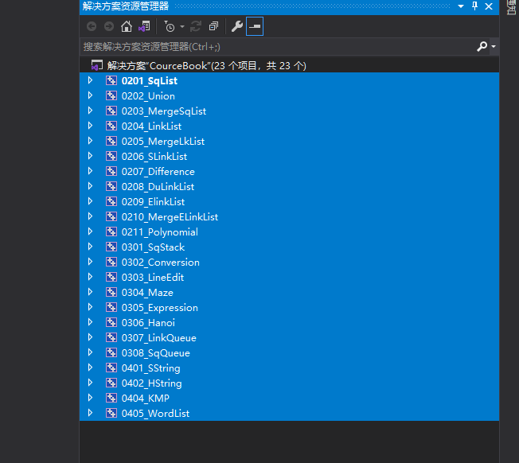
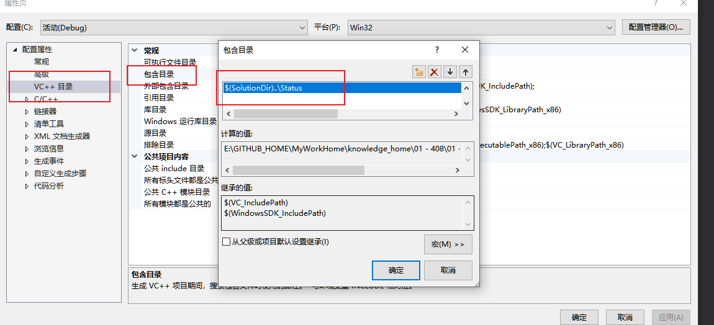
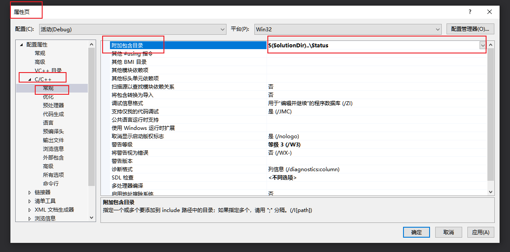

使用方法:

1. VS2019加载解决方案

   文件->打开->项目/解决方案，选择CourceBook.sln

2. 设置编译目录

   - 选中项目

     

   - 点击属性->VC++目录->包含目录->编辑

     ​	输入:$(SolutionDir)..\Status

     > 因为所有项目共用Status，所以这样导入

     

   - 仍然是属性->C/C++->常规->附加包含目录:

     输入:$(SolutionDir)..\Status

     

   

3. 运行

   

